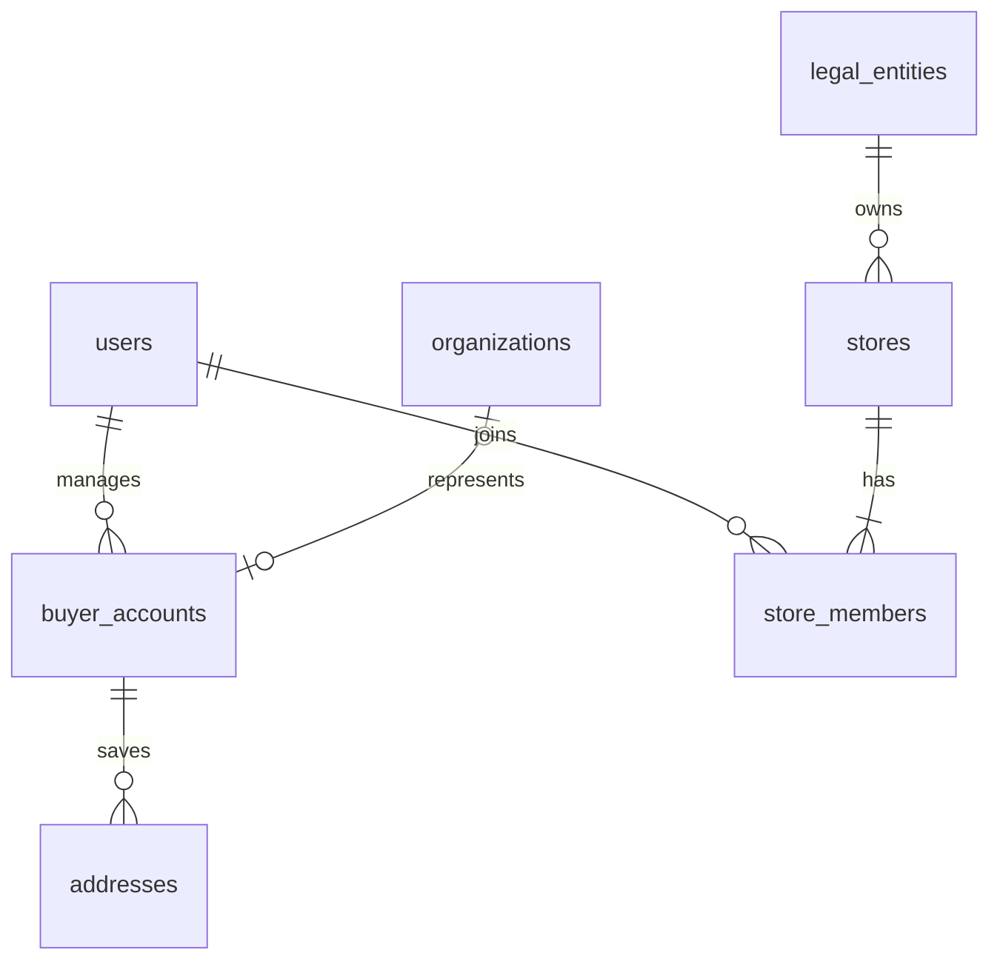
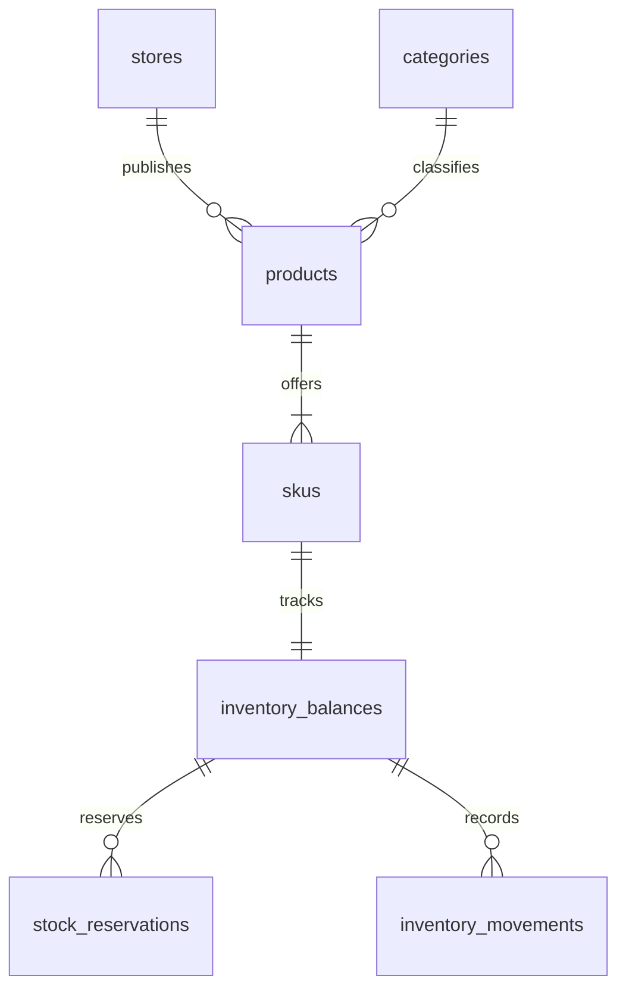
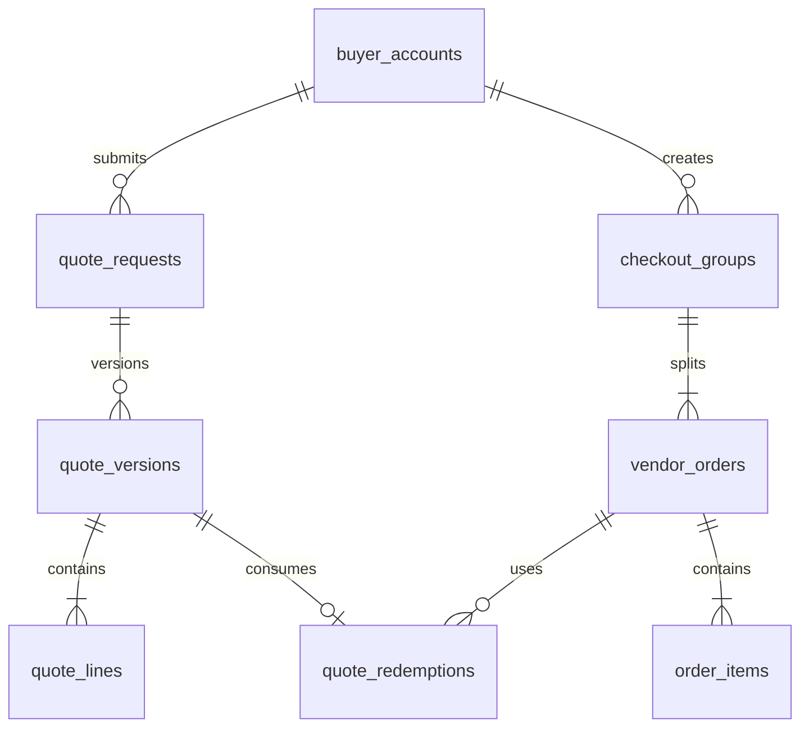
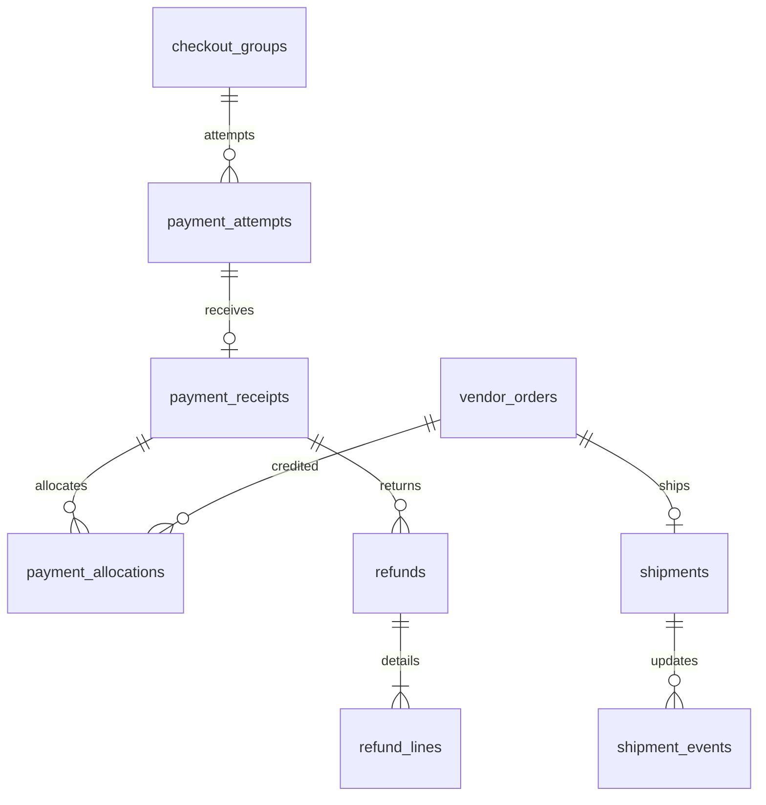
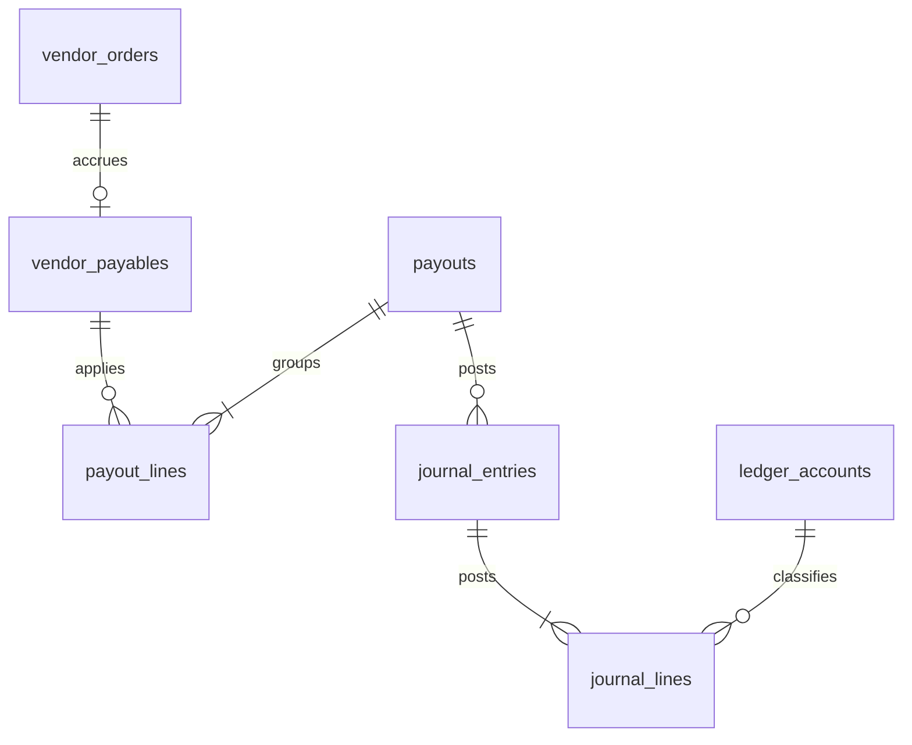

# Rancangan Skema Database & Struktur Tabel

**Marketplace multi-vendor — web app responsif**  
Versi desain 0.1 • 5 September 2026 • Acuan: SRS v0.2  
Status: rancangan untuk implementasi; belum migration SQL atau database yang telah dijalankan.

## 1. Keputusan arsitektur

Usulan database: **PostgreSQL**, dengan satu database transaksional dan pemisahan modul melalui tabel. Pemilihan ini merupakan baseline desain, belum keputusan stack pengguna. Frontend web tidak mengakses database langsung. Backend mengelola otorisasi, transaksi, queue, dan adapter Midtrans/Biteship.

Satu checkout menghasilkan beberapa vendor-order, tetapi hanya satu pembayaran utama yang dialokasikan. Pembayaran aktual yang berlebih tetap dicatat untuk refund, tidak dihilangkan oleh constraint. Harga, alamat, pajak, dan komisi disalin saat checkout. Status payment, fulfillment, refund, serta payout berdiri sendiri.

### Konvensi kamus data

Setiap tabel di bawah memiliki `id UUID PK NOT NULL` dan `created_at TIMESTAMPTZ NOT NULL DEFAULT now()` kecuali disebut berbeda. UUID dibuat backend. Tabel yang dapat diubah juga memiliki `updated_at TIMESTAMPTZ NOT NULL` dan `row_version BIGINT NOT NULL DEFAULT 0`; kolom ini ditambahkan secara standar meskipun tidak diulang pada setiap tabel. Tabel bertanda append-only tidak memiliki updated_at.

Tanda `?` pada tipe berarti NULL diperbolehkan; tanpa tanda berarti NOT NULL. `→ table` adalah FK ke `table.id`. Nilai default hanya yang dituliskan; kolom wajib lain harus diisi. Kolom digabung dengan koma pada satu baris berarti beberapa kolom terpisah dengan tipe yang sama, bukan string CSV.

Uang tersimpan `BIGINT` rupiah; rates menggunakan `NUMERIC(12,8)` berupa fraksi (0.02 = 2%). DPP factor disimpan numerator/denominator integer. Quantity integer positif; berat gram; dimensi cm. Waktu UTC dengan tampilan zona pengguna. `currency CHAR(3)` dibatasi IDR pada MVP.

Semua FK menggunakan `ON DELETE RESTRICT` sebagai default. Master diarsipkan, bukan dihapus jika pernah dipakai transaksi. JSONB hanya untuk snapshot, atribut fleksibel, serta data provider; hubungan dan nilai keuangan penting tetap kolom/FK. Payload sensitif dienkripsi atau disimpan sebagai object reference privat, dengan retensi terpisah.

Constraint CHECK berlaku per baris. Invariant total antartabel memerlukan transaksi terkunci serta prosedur posting/constraint trigger; jangan menyatakannya terjamin oleh CHECK biasa. Partial unique index digunakan untuk keunikan bersyarat. [PostgreSQL — Constraints](https://www.postgresql.org/docs/current/ddl-constraints.html), [Partial indexes](https://www.postgresql.org/docs/current/indexes-partial.html)

## 2. ERD per domain

Diagram menampilkan relasi utama; seluruh FK dan aturan tambahan tercantum dalam kamus data. `o{` = nol atau banyak; `|{` = satu atau banyak; `o|` = nol atau satu. Minimum satu anak pada objek yang difinalisasi ditegakkan prosedur transaksi, bukan FK biasa.

### Identitas dan kepemilikan



### Katalog dan persediaan



### Penawaran sampai pesanan



### Pembayaran dan pengiriman



### Keuangan vendor



## 3. Kamus data

Rancangan berisi **56 tabel** yang dikelompokkan secara logis. Ini mencakup tabel operasional dan kontrol keuangan; tidak semuanya menjadi halaman web tersendiri.


### 01. `users`

Identitas login; peran toko tidak disimpan sebagai satu role global.

| Kolom | Tipe / null | Aturan / arti |
| --- | --- | --- |

| `email_normalized` | TEXT | UNIQUE; lowercase sesuai kebijakan login |

| `password_hash` | TEXT | Hash adaptif, bukan ciphertext password |

| `name` | TEXT | Nama tampilan |

| `phone` | TEXT? | Format internasional |

| `status` | TEXT | ACTIVE, DISABLED |

| `email_verified_at` | TIMESTAMPTZ? | Waktu verifikasi |


**Constraint dan indeks:** UQ(email_normalized). ID publik tidak menggantikan pemeriksaan akses.


### 02. `auth_tokens`

Verifikasi email, reset, dan sesi web tersimpan server.

| Kolom | Tipe / null | Aturan / arti |
| --- | --- | --- |

| `user_id` | UUID | → users |

| `purpose` | TEXT | VERIFY_EMAIL, RESET_PASSWORD, SESSION |

| `token_hash` | TEXT | UNIQUE; tidak menyimpan token mentah |

| `expires_at` | TIMESTAMPTZ | Tenggat |

| `consumed_at, revoked_at` | TIMESTAMPTZ? | Sekali pakai atau pencabutan |


**Constraint dan indeks:** Index(user_id,purpose), (expires_at). Konsumsi reset atomik WHERE consumed_at IS NULL; sesi dirotasi setelah login/reset.


### 03. `admin_grants`

Hak global terpisah dari hak organisasi/toko.

| Kolom | Tipe / null | Aturan / arti |
| --- | --- | --- |

| `user_id` | UUID | → users |

| `role_code` | TEXT | OPERATIONS, FINANCE, FINANCE_APPROVER, SUPERADMIN |

| `revoked_at` | TIMESTAMPTZ? | Akses aktif bila NULL |


**Constraint dan indeks:** Partial UQ(user_id,role_code) WHERE revoked_at IS NULL.


### 04. `organizations`

Profil organisasi pembeli.

| Kolom | Tipe / null | Aturan / arti |
| --- | --- | --- |

| `name` | TEXT | Nama sekolah/organisasi |

| `kind` | TEXT | SCHOOL, COMPANY, OTHER |

| `school_identifier` | TEXT? | Identitas tambahan, bukan verifikasi resmi |

| `contact_name, contact_phone` | TEXT | Kontak |

| `status` | TEXT | ACTIVE, ARCHIVED |


**Constraint dan indeks:** Index(name). Identitas sekolah tidak diasumsikan unik lintas sistem tanpa normalisasi.


### 05. `buyer_accounts`

Konteks pembelian individu/organisasi; menghindari FK polymorphic di seluruh order.

| Kolom | Tipe / null | Aturan / arti |
| --- | --- | --- |

| `manager_user_id` | UUID | → users; satu pengelola pada MVP |

| `organization_id` | UUID? | → organizations |

| `kind` | TEXT | INDIVIDUAL, ORGANIZATION |

| `status` | TEXT | ACTIVE, DISABLED |


**Constraint dan indeks:** CHECK pasangan kind/organization_id konsisten. UQ(organization_id); partial UQ(manager_user_id) WHERE kind=INDIVIDUAL. Pergantian pengelola diaudit; order tetap terikat akun organisasi.


### 06. `addresses`

Buku alamat milik konteks pembeli.

| Kolom | Tipe / null | Aturan / arti |
| --- | --- | --- |

| `buyer_account_id` | UUID | → buyer_accounts |

| `label, recipient_name, phone` | TEXT | Label dan penerima |

| `street, province, city, district, postal_code` | TEXT | Alamat; kode pos bukan integer |

| `area_id` | TEXT? | ID lokasi Biteship |

| `latitude, longitude` | NUMERIC(10,7)? | Harus bersama; rentang koordinat valid |

| `is_default` | BOOLEAN | DEFAULT false |

| `archived_at` | TIMESTAMPTZ? | Arsip |


**Constraint dan indeks:** UQ(id,buyer_account_id); partial UQ(buyer_account_id) WHERE is_default AND archived_at IS NULL.


### 07. `legal_entities`

Pihak hukum penjual/platform; satu entitas dapat memiliki banyak toko.

| Kolom | Tipe / null | Aturan / arti |
| --- | --- | --- |

| `kind` | TEXT | INDIVIDUAL, COMPANY |

| `legal_name` | TEXT | Nama legal |

| `tax_identifier_ciphertext` | BYTEA? | NIK/NPWP terenkripsi |

| `tax_identifier_fingerprint` | TEXT? | HMAC normalisasi untuk deduplikasi |

| `is_platform` | BOOLEAN | DEFAULT false |

| `status` | TEXT | PENDING, VERIFIED, SUSPENDED |


**Constraint dan indeks:** UQ(tax_identifier_fingerprint) jika terisi; partial unique is_platform WHERE true untuk satu entitas platform. Jangan menghitung batas omzet per toko.


### 08. `stores`

Profil dan status moderasi vendor.

| Kolom | Tipe / null | Aturan / arti |
| --- | --- | --- |

| `legal_entity_id` | UUID | → legal_entities |

| `slug` | TEXT | UNIQUE |

| `name, contact_phone` | TEXT | Profil publik |

| `status` | TEXT | DRAFT, SUBMITTED, ACTIVE, REJECTED, SUSPENDED |

| `moderation_reason` | TEXT? | Alasan |

| `reviewed_by` | UUID? | → users |

| `reviewed_at` | TIMESTAMPTZ? | Waktu review |


**Constraint dan indeks:** Index(legal_entity_id), (status,created_at). Aktivasi memerlukan anggota owner dan asal valid.


### 09. `store_members`

Membership vendor, meskipun awal satu pemilik.

| Kolom | Tipe / null | Aturan / arti |
| --- | --- | --- |

| `store_id` | UUID | → stores |

| `user_id` | UUID | → users |

| `role_code` | TEXT | OWNER, CATALOG, FULFILLMENT |

| `revoked_at` | TIMESTAMPTZ? | NULL aktif |


**Constraint dan indeks:** Partial UQ(store_id,user_id) WHERE revoked_at IS NULL; partial UQ(store_id) WHERE role_code=OWNER AND revoked_at IS NULL. Transaksi perubahan owner menjaga minimal satu owner aktif.


### 10. `store_origins`

Satu alamat pengiriman aktif per toko pada MVP.

| Kolom | Tipe / null | Aturan / arti |
| --- | --- | --- |

| `store_id` | UUID | → stores |

| `contact_name, phone, street, postal_code` | TEXT | Asal paket |

| `area_id` | TEXT? | ID lokasi provider |

| `latitude, longitude` | NUMERIC(10,7)? | Koordinat |

| `active` | BOOLEAN | DEFAULT true |


**Constraint dan indeks:** UQ(id,store_id); partial UQ(store_id) WHERE active. Snapshot asal tidak berubah ketika master diperbarui.


### 11. `tax_profiles`

Versi status perpajakan untuk legal entity.

| Kolom | Tipe / null | Aturan / arti |
| --- | --- | --- |

| `legal_entity_id` | UUID | → legal_entities |

| `is_pkp, collector_enabled` | BOOLEAN | DEFAULT false |

| `valid_from` | TIMESTAMPTZ | Awal berlaku |

| `valid_until` | TIMESTAMPTZ? | Akhir eksklusif |

| `status` | TEXT | DRAFT, VERIFIED |

| `verified_by` | UUID? | → users |

| `collector_basis_document_id` | UUID? | → documents; dasar penunjukan |

| `profile_snapshot` | JSONB | Detail keputusan dan pengecualian |


**Constraint dan indeks:** CHECK(valid_until IS NULL OR valid_until>valid_from). Cegah rentang VERIFIED bertumpuk per entitas melalui exclusion constraint atau transaksi lock entitas. collector hanya entitas platform dengan dokumen valid.


### 12. `documents`

Metadata dokumen privat termasuk pajak, bukti refund/payout, faktur.

| Kolom | Tipe / null | Aturan / arti |
| --- | --- | --- |

| `legal_entity_id` | UUID? | → legal_entities |

| `vendor_order_id` | UUID? | → vendor_orders |

| `uploaded_by` | UUID | → users |

| `document_type` | TEXT | NPWP, PKP, SKB, TURNOVER_STATEMENT, INVOICE, TAX_INVOICE, PAYOUT_PROOF, REFUND_PROOF, OTHER |

| `object_key, sha256, mime_type` | TEXT | Storage privat, bukan signed URL permanen |

| `valid_from, valid_until` | DATE? | Masa dokumen |

| `verification_status` | TEXT | PENDING, VERIFIED, REJECTED |

| `verified_by` | UUID? | → users |

| `metadata` | JSONB | Nomor dokumen/tahun dan detail terbatas |


**Constraint dan indeks:** Index(legal_entity_id,document_type), (vendor_order_id). Masa dan scope per jenis divalidasi. FK siklik tax_profiles/documents ditambahkan tahap akhir.


### 13. `tax_classes`

Klasifikasi produk, bukan tarif tunggal.

| Kolom | Tipe / null | Aturan / arti |
| --- | --- | --- |

| `code` | TEXT | UNIQUE |

| `name` | TEXT | Nama kelas |

| `status` | TEXT | UNVERIFIED, ACTIVE, DISABLED |


**Constraint dan indeks:** Produk ACTIVE hanya memakai kelas ACTIVE melalui validasi transaksi.


### 14. `tax_policies`

Aturan pajak berversi; profil entitas menentukan applicability.

| Kolom | Tipe / null | Aturan / arti |
| --- | --- | --- |

| `tax_class_id` | UUID? | → tax_classes; NULL untuk jasa/withholding platform |

| `policy_key` | TEXT | Scope aturan stabil |

| `kind` | TEXT | ITEM_VAT, COMMISSION_VAT, SELLER_WITHHOLDING |

| `rate` | NUMERIC(12,8) | Fraksi 0..1 |

| `dpp_numerator, dpp_denominator` | INTEGER | Faktor rasional; denominator>0 |

| `valid_from` | TIMESTAMPTZ | Mulai berlaku |

| `valid_until` | TIMESTAMPTZ? | Akhir eksklusif |

| `status` | TEXT | DRAFT, ACTIVE, RETIRED |

| `rule_parameters` | JSONB | Syarat dan referensi hukum |


**Constraint dan indeks:** UQ(policy_key,valid_from); larang overlap ACTIVE pada policy_key. Jangan menanam angka pajak hanya pada kode aplikasi.


### 15. `fee_policies`

Komisi kategori atau default; prioritas eksplisit.

| Kolom | Tipe / null | Aturan / arti |
| --- | --- | --- |

| `category_id` | UUID? | → categories; NULL default |

| `policy_key` | TEXT | Scope aturan |

| `commission_rate` | NUMERIC(12,8) | 0..1; usulan awal 0.02 |

| `buyer_fee_amount` | BIGINT | DEFAULT 0; >=0 |

| `valid_from` | TIMESTAMPTZ | Mulai berlaku |

| `valid_until` | TIMESTAMPTZ? | Akhir eksklusif |

| `status` | TEXT | DRAFT, ACTIVE, RETIRED |


**Constraint dan indeks:** UQ(policy_key,valid_from). Cegah overlap per scope; kategori terdekat pada hierarki menang atas default. Snapshot komisi per order item.


### 16. `categories`

Hierarki kategori dan definisi atribut.

| Kolom | Tipe / null | Aturan / arti |
| --- | --- | --- |

| `parent_id` | UUID? | → categories |

| `slug` | TEXT | UNIQUE |

| `name` | TEXT | Nama |

| `attribute_schema` | JSONB | Schema atribut untuk validasi |

| `status` | TEXT | ACTIVE, ARCHIVED |


**Constraint dan indeks:** Index(parent_id). CHECK(parent_id<>id); cegah siklus lebih panjang dalam prosedur perubahan kategori.


### 17. `products`

Master produk toko.

| Kolom | Tipe / null | Aturan / arti |
| --- | --- | --- |

| `store_id` | UUID | → stores |

| `category_id` | UUID | → categories |

| `tax_class_id` | UUID | → tax_classes |

| `name, description` | TEXT | Konten katalog |

| `attributes` | JSONB | Atribut sesuai kategori |

| `status` | TEXT | DRAFT, ACTIVE, ARCHIVED |

| `slug` | TEXT | Identitas URL dalam toko |


**Constraint dan indeks:** UQ(store_id,slug), UQ(id,store_id); index(category_id,status). Search index ditambahkan sesuai query terukur.


### 18. `product_media`

Gambar produk.

| Kolom | Tipe / null | Aturan / arti |
| --- | --- | --- |

| `product_id` | UUID | → products |

| `object_key, alt_text` | TEXT | Lokasi file dan alternatif teks |

| `sort_order` | INTEGER | >=0 |


**Constraint dan indeks:** UQ(product_id,sort_order). File divalidasi ukuran/tipe sebelum publikasi.


### 19. `skus`

Varian sekaligus harga jual master; nilai uang final termasuk pajak bila berlaku.

| Kolom | Tipe / null | Aturan / arti |
| --- | --- | --- |

| `product_id, store_id` | UUID | → products, stores; harus pasangan yang sama |

| `sku_code` | TEXT | Unik dalam toko |

| `variant_attributes` | JSONB | Warna, ukuran, dan atribut |

| `unit_label` | TEXT | pcs, pak, unit |

| `unit_price_gross` | BIGINT | >0 |

| `weight_g` | INTEGER | >0 |

| `length_cm, width_cm, height_cm` | NUMERIC(10,2) | >0 |

| `status` | TEXT | ACTIVE, ARCHIVED |


**Constraint dan indeks:** UQ(store_id,sku_code), UQ(id,store_id). Composite FK(product_id,store_id)→products(id,store_id). Harga bersih dan VAT dihitung tax engine, tidak diasumsikan sama semua SKU.


### 20. `inventory_balances`

Saldo persediaan otoritatif per SKU; satu lokasi per toko.

| Kolom | Tipe / null | Aturan / arti |
| --- | --- | --- |

| `sku_id` | UUID | → skus; UNIQUE |

| `on_hand` | INTEGER | DEFAULT 0 |

| `reserved` | INTEGER | DEFAULT 0 |


**Constraint dan indeks:** CHECK(on_hand>=0 AND reserved>=0 AND reserved<=on_hand). UQ(id,sku_id). Available dihitung, bukan saldo ketiga yang diedit.


### 21. `inventory_movements`

Jejak perubahan on_hand/reserved. **Append-only.**

| Kolom | Tipe / null | Aturan / arti |
| --- | --- | --- |

| `inventory_id` | UUID | → inventory_balances |

| `reservation_id` | UUID? | → stock_reservations |

| `on_hand_delta, reserved_delta` | INTEGER | Perubahan signed |

| `reason` | TEXT | RESTOCK, RESERVE, CONSUME, RELEASE, ADJUST, RETURN |

| `event_key` | TEXT | UNIQUE |

| `actor_id` | UUID? | → users |


**Constraint dan indeks:** Index(inventory_id,created_at). CHECK setidaknya satu delta bukan nol. Update balance dan movement dalam transaksi yang sama.


### 22. `quote_requests`

Satu permintaan penawaran kepada satu toko.

| Kolom | Tipe / null | Aturan / arti |
| --- | --- | --- |

| `buyer_account_id` | UUID | → buyer_accounts |

| `store_id` | UUID | → stores |

| `requested_by` | UUID | → users |

| `address_snapshot` | JSONB | Tujuan permintaan |

| `notes` | TEXT? | Catatan |

| `status` | TEXT | SUBMITTED, OFFERED, REJECTED, CLOSED |


**Constraint dan indeks:** Index(store_id,status,created_at), (buyer_account_id,created_at); UQ(id,store_id).


### 23. `quote_request_lines`

Baris kebutuhan awal, sebelum vendor memberi harga.

| Kolom | Tipe / null | Aturan / arti |
| --- | --- | --- |

| `quote_request_id, store_id` | UUID | → quote_requests, stores |

| `sku_id` | UUID | → skus |

| `quantity` | INTEGER | >0 |

| `product_snapshot` | JSONB | Nama/varian ketika meminta |


**Constraint dan indeks:** UQ(quote_request_id,sku_id); composite FK untuk request/store dan sku/store.


### 24. `quote_versions`

Penawaran vendor berversi; versi diterima tidak diedit.

| Kolom | Tipe / null | Aturan / arti |
| --- | --- | --- |

| `quote_request_id` | UUID | → quote_requests |

| `version_no` | INTEGER | >0 |

| `status` | TEXT | OFFERED, SUPERSEDED, ACCEPTED, DECLINED, EXPIRED, CONSUMED |

| `expires_at` | TIMESTAMPTZ | Masa harga berlaku |

| `accepted_by` | UUID? | → users |

| `accepted_at` | TIMESTAMPTZ? | Waktu persetujuan |


**Constraint dan indeks:** UQ(quote_request_id,version_no); partial UQ(quote_request_id) WHERE status IN (OFFERED,ACCEPTED). Lock request saat revisi; CONSUMED tidak dibuka kembali.


### 25. `quote_lines`

Snapshot kuantitas dan harga per versi.

| Kolom | Tipe / null | Aturan / arti |
| --- | --- | --- |

| `quote_version_id` | UUID | → quote_versions |

| `sku_id` | UUID | → skus |

| `quantity` | INTEGER | >0 |

| `unit_price_gross` | BIGINT | >0 |

| `item_snapshot` | JSONB | Spesifikasi dan konteks harga |


**Constraint dan indeks:** UQ(quote_version_id,sku_id). Store SKU harus sama dengan store request lewat prosedur; larang edit setelah versi diterima.


### 26. `carts`

Keranjang persisten per buyer context.

| Kolom | Tipe / null | Aturan / arti |
| --- | --- | --- |

| `buyer_account_id` | UUID | → buyer_accounts; UNIQUE |


**Constraint dan indeks:** Lock cart untuk perubahan dan validasi row_version agar preview lama terdeteksi.


### 27. `cart_items`

Baris harga katalog atau penawaran.

| Kolom | Tipe / null | Aturan / arti |
| --- | --- | --- |

| `cart_id` | UUID | → carts |

| `sku_id` | UUID | → skus |

| `quote_line_id` | UUID? | → quote_lines; NULL katalog |

| `quantity` | INTEGER | >0 |


**Constraint dan indeks:** Partial UQ(cart_id,sku_id) WHERE quote_line_id IS NULL; UQ(cart_id,quote_line_id) untuk baris penawaran. Quote buyer/SKU harus cocok. Seluruh baris versi penawaran dikonsumsi bersama.


### 28. `shipping_quotes`

Hasil harga layanan per toko dan pratinjau.

| Kolom | Tipe / null | Aturan / arti |
| --- | --- | --- |

| `buyer_account_id` | UUID | → buyer_accounts |

| `store_id` | UUID | → stores |

| `provider_account_id` | UUID | → provider_accounts |

| `input_hash` | TEXT | Hash SKU/qty/paket/asal/tujuan |

| `courier_code, service_code` | TEXT | Kode provider |

| `final_amount` | BIGINT | >=0; tidak berarti timeout nol |

| `origin_snapshot, destination_snapshot, package_snapshot, price_breakdown` | JSONB | Input dan biaya |

| `fetched_at, valid_until` | TIMESTAMPTZ | TTL internal |


**Constraint dan indeks:** Index(buyer_account_id,store_id,input_hash), (valid_until); UQ(id,store_id). Tidak semua provider memberi rate ID, jangan membuat FK ke ID yang tidak ada.


### 29. `checkout_groups`

Header transaksi pembeli; snapshot final.

| Kolom | Tipe / null | Aturan / arti |
| --- | --- | --- |

| `buyer_account_id` | UUID | → buyer_accounts |

| `created_by` | UUID | → users |

| `order_number` | TEXT | UNIQUE |

| `currency` | CHAR(3) | DEFAULT IDR |

| `recipient_snapshot` | JSONB | Alamat dan kontak final |

| `items_gross, shipping_total, buyer_fee_total, platform_discount, grand_total` | BIGINT | Nonnegatif; snapshot final |

| `order_state` | TEXT | AWAITING_PAYMENT, ACTIVE, CANCEL_REQUESTED, CANCELLED, EXPIRED, REVIEW, COMPLETED |

| `reservation_expires_at` | TIMESTAMPTZ | Tenggat reservasi |

| `pricing_snapshot` | JSONB | Versi kebijakan dan fingerprint preview |


**Constraint dan indeks:** CHECK(grand_total=items_gross+shipping_total+buyer_fee_total-platform_discount AND grand_total>0). Index(buyer_account_id,created_at). Status pembayaran kelompok diturunkan dari receipts, bukan boolean paid.


### 30. `vendor_orders`

Satu pesanan per toko di checkout.

| Kolom | Tipe / null | Aturan / arti |
| --- | --- | --- |

| `checkout_group_id` | UUID | → checkout_groups |

| `store_id` | UUID | → stores |

| `shipping_quote_id` | UUID | → shipping_quotes |

| `order_number` | TEXT | UNIQUE |

| `items_net, items_vat, items_gross, shipping_amount, buyer_fee, platform_discount, buyer_total` | BIGINT | Snapshot >=0 |

| `fulfillment_status` | TEXT | UNFULFILLED, PROCESSING, SHIPPED, DELIVERED, COMPLETED, CANCELLED, REVIEW |

| `commission_amount, commission_vat, seller_withholding` | BIGINT | Snapshot >=0 |

| `seller_tax_snapshot, origin_snapshot` | JSONB | Keputusan pajak/asalan final |

| `completed_at, dispute_deadline` | TIMESTAMPTZ? | Dasar eligible payout |


**Constraint dan indeks:** UQ(checkout_group_id,store_id), UQ(id,store_id), UQ(id,checkout_group_id). FK(shipping_quote_id,store_id)→shipping_quotes(id,store_id); cocok buyer dalam prosedur. CHECK items_gross=items_net+items_vat; buyer_total=items_gross+shipping_amount+buyer_fee-platform_discount.


### 31. `order_items`

Baris transaksi immutable, terpisah dari katalog.

| Kolom | Tipe / null | Aturan / arti |
| --- | --- | --- |

| `vendor_order_id, store_id` | UUID | → vendor_orders, stores |

| `sku_id` | UUID | → skus |

| `quote_line_id` | UUID? | → quote_lines |

| `quantity` | INTEGER | >0 |

| `unit_price_gross, line_net, line_vat, line_gross, vendor_discount` | BIGINT | Snapshot >=0 |

| `commission_amount, commission_vat, seller_withholding` | BIGINT | Snapshot >=0 |

| `product_snapshot, tax_snapshot, fee_snapshot` | JSONB | Nama/SKU/unit/rates/DPP/exemption/dokumen |


**Constraint dan indeks:** Composite FK(order,store), FK(sku,store). UQ(id,vendor_order_id), UQ(id,sku_id). CHECK line_gross=line_net+line_vat dan line_gross=quantity*unit_price_gross-vendor_discount. Harga quote dipakai tanpa diskon vendor tambahan pada MVP.


### 32. `quote_redemptions`

Bukti konsumsi satu penawaran, termasuk ketika order dibatalkan. **Append-only.**

| Kolom | Tipe / null | Aturan / arti |
| --- | --- | --- |

| `quote_version_id` | UUID | → quote_versions; UNIQUE |

| `vendor_order_id` | UUID | → vendor_orders |


**Constraint dan indeks:** Validasi buyer, toko, jumlah dan seluruh quote_lines sama dengan order_items. Insert atomik checkout; tidak dihapus pada cancel.


### 33. `stock_reservations`

Reservasi per order item, bahkan jika SKU muncul dari dua sumber harga.

| Kolom | Tipe / null | Aturan / arti |
| --- | --- | --- |

| `order_item_id, sku_id` | UUID | → order_items, skus |

| `inventory_id` | UUID | → inventory_balances |

| `quantity` | INTEGER | >0 |

| `state` | TEXT | ACTIVE, CONSUMED, RELEASED |

| `expires_at` | TIMESTAMPTZ | Tenggat aktual |

| `closed_at` | TIMESTAMPTZ? | Waktu terminal |


**Constraint dan indeks:** UQ(order_item_id); FK(order_item_id,sku_id)→order_items(id,sku_id), FK(inventory_id,sku_id)→inventory_balances(id,sku_id). Index(expires_at) WHERE state=ACTIVE. SUM active quantity=reserved dijaga transaksi dan rekonsiliasi.


### 34. `provider_accounts`

Identitas akun provider dan lingkungan; tanpa server key di tabel.

| Kolom | Tipe / null | Aturan / arti |
| --- | --- | --- |

| `provider` | TEXT | MIDTRANS, BITESHIP |

| `environment` | TEXT | SANDBOX, PRODUCTION |

| `merchant_reference` | TEXT | ID akun penyedia |

| `secret_reference` | TEXT | Referensi secret manager |

| `status` | TEXT | ACTIVE, DISABLED |

| `capabilities` | JSONB | Kanal, kurir, dukungan refund yang telah diverifikasi |


**Constraint dan indeks:** UQ(provider,environment,merchant_reference). IDs eksternal selalu scoped oleh akun/lingkungan.


### 35. `payment_attempts`

Sesi/tagihan gateway; bukan bukti dana diterima.

| Kolom | Tipe / null | Aturan / arti |
| --- | --- | --- |

| `checkout_group_id` | UUID | → checkout_groups |

| `provider_account_id` | UUID | → provider_accounts |

| `provider_order_id` | TEXT | Order ID unik yang dikirim backend |

| `provider_transaction_id` | TEXT? | ID respons |

| `expected_amount` | BIGINT | >0 |

| `currency` | CHAR(3) | IDR |

| `channel` | TEXT? | Belum dipilih pada awal sesi |

| `state` | TEXT | CREATING, PENDING, CANCEL_REQUESTED, UNKNOWN, TERMINAL |

| `provider_status` | TEXT? | Status mentah terakhir |

| `expires_at, terminal_verified_at` | TIMESTAMPTZ? | Tenggat/bukti terminal |

| `session_secret_ciphertext` | BYTEA? | Token/URL Snap dibatasi akses |


**Constraint dan indeks:** UQ(provider_account_id,provider_order_id); UQ(provider_account_id,provider_transaction_id). Partial UQ(checkout_group_id) WHERE terminal_verified_at IS NULL. UNKNOWN tetap memblokir attempt baru. Pembayaran sukses menutup attempt namun receipt tetap disimpan.


### 36. `payment_events`

Inbox webhook dan hasil polling pembayaran.

| Kolom | Tipe / null | Aturan / arti |
| --- | --- | --- |

| `provider_account_id` | UUID | → provider_accounts |

| `payment_attempt_id` | UUID? | → payment_attempts; NULL bila belum terpetakan |

| `dedupe_key` | TEXT | Event ID jika tersedia atau canonical hash |

| `source` | TEXT | WEBHOOK, POLL, RECONCILIATION |

| `payload_reference` | TEXT | Object privat/encrypted |

| `verification_status` | TEXT | UNVERIFIED, VERIFIED, REJECTED |

| `processing_status` | TEXT | RECEIVED, PROCESSING, DONE, ERROR |

| `last_error` | TEXT? | Error tanpa rahasia |

| `processed_at` | TIMESTAMPTZ? | Selesai |


**Constraint dan indeks:** UQ(provider_account_id,dedupe_key); index(processing_status,created_at). Retry delivery tidak dianggap event bisnis baru; posting receipt terpisah dari dedupe transport.


### 37. `payment_receipts`

Dana yang benar-benar diterima; mendukung pembayaran terlambat/duplikat lintas attempt.

| Kolom | Tipe / null | Aturan / arti |
| --- | --- | --- |

| `payment_attempt_id` | UUID | → payment_attempts; UNIQUE |

| `checkout_group_id` | UUID | → checkout_groups |

| `provider_account_id` | UUID | → provider_accounts |

| `provider_transaction_id` | TEXT | ID penerimaan unik |

| `amount` | BIGINT | >0 |

| `received_at` | TIMESTAMPTZ | Waktu terverifikasi |

| `application_status` | TEXT | UNAPPLIED, APPLIED, EXCESS_REVIEW |

| `fee_actual, fee_tax_actual` | BIGINT? | Biaya aktual belum tentu tersedia saat webhook |

| `provider_funds_available_at` | TIMESTAMPTZ? | Beda dengan PAID pembeli |


**Constraint dan indeks:** UQ(provider_account_id,provider_transaction_id), UQ(id,checkout_group_id). Partial UQ(checkout_group_id) WHERE application_status=APPLIED. Receipt EXCESS tetap dicatat dan direfund, bukan gagal insert/hilang.


### 38. `payment_allocations`

Alokasi pembayaran utama ke pesanan vendor. **Append-only.**

| Kolom | Tipe / null | Aturan / arti |
| --- | --- | --- |

| `payment_receipt_id, checkout_group_id` | UUID | → payment_receipts, checkout_groups |

| `vendor_order_id` | UUID | → vendor_orders |

| `amount` | BIGINT | >0 |


**Constraint dan indeks:** UQ(payment_receipt_id,vendor_order_id). FK(receipt,group), FK(order,group). SUM amount=receipt amount untuk APPLIED diverifikasi posting; receipt EXCESS tidak dialokasikan ke order.


### 39. `shipments`

Satu paket logis per vendor-order.

| Kolom | Tipe / null | Aturan / arti |
| --- | --- | --- |

| `vendor_order_id` | UUID | → vendor_orders; UNIQUE |

| `provider_account_id` | UUID | → provider_accounts |

| `booking_reference` | TEXT | UNIQUE internal |

| `provider_order_id, waybill_id` | TEXT? | ID Biteship dan resi |

| `state` | TEXT | NOT_BOOKED, BOOKING, BOOKED, PICKED_UP, IN_TRANSIT, DELIVERED, CANCELLED, SHIPMENT_REVIEW |

| `courier_code, service_code` | TEXT | Layanan |

| `package_snapshot` | JSONB | Kontak asal/tujuan dan kemasan final |

| `quoted_amount, actual_amount` | BIGINT | >=0; actual awal sama quoted |

| `vendor_ready_at, booked_at, delivered_at` | TIMESTAMPTZ? | Waktu |


**Constraint dan indeks:** UQ(provider_account_id,provider_order_id); index(state,updated_at). Timeout BOOKING tidak membuat row baru. Rebooking setelah pembatalan di luar MVP; retry hanya setelah status eksternal dipastikan.


### 40. `shipment_events`

Jejak event status, perubahan resi, dan biaya.

| Kolom | Tipe / null | Aturan / arti |
| --- | --- | --- |

| `shipment_id` | UUID? | → shipments |

| `provider_account_id` | UUID | → provider_accounts |

| `dedupe_key, event_type` | TEXT | Canonical identity dan jenis |

| `payload_reference` | TEXT | Payload privat |

| `verification_status, processing_status` | TEXT | Seperti payment_events |

| `provider_occurred_at, processed_at` | TIMESTAMPTZ? | Waktu provider opsional |


**Constraint dan indeks:** UQ(provider_account_id,dedupe_key). Resi lama dipertahankan dalam event; koreksi biaya masuk ledger adjustment, bukan edit tagihan pembeli.


### 41. `refunds`

Pengembalian atas receipt tertentu; seluruh maupun sebagian.

| Kolom | Tipe / null | Aturan / arti |
| --- | --- | --- |

| `payment_receipt_id` | UUID | → payment_receipts |

| `reference` | TEXT | UNIQUE internal |

| `provider_refund_id` | TEXT? | ID eksternal |

| `amount` | BIGINT | >0 |

| `state` | TEXT | REQUESTED, APPROVED, PROCESSING, UNKNOWN, SUCCEEDED, FAILED, REJECTED |

| `reason` | TEXT | Alasan |

| `requested_by, approved_by` | UUID? | → users |

| `proof_document_id` | UUID? | → documents; refund manual |

| `completed_at` | TIMESTAMPTZ? | Waktu bukti berhasil |


**Constraint dan indeks:** UQ(payment_receipt_id,provider_refund_id). Lock receipt untuk SUM refund aktif+berhasil<=amount; UNKNOWN tetap menahan kapasitas refund. Retry mempertahankan reference.


### 42. `refund_lines`

Rincian tujuan refund dan koreksi komponen.

| Kolom | Tipe / null | Aturan / arti |
| --- | --- | --- |

| `refund_id` | UUID | → refunds |

| `vendor_order_id` | UUID? | → vendor_orders |

| `order_item_id` | UUID? | → order_items |

| `component` | TEXT | ITEM, SHIPPING, BUYER_FEE, EXCESS_PAYMENT |

| `amount` | BIGINT | >0 |

| `quantity` | INTEGER? | Untuk item, tidak wajib untuk adjustment uang |

| `tax_reversal_snapshot, fee_reversal_snapshot` | JSONB | Alokasi refund dan koreksi pajak/komisi |


**Constraint dan indeks:** CHECK: EXCESS_PAYMENT tanpa order/item; selainnya order wajib; ITEM item wajib. FK(item,order)→order_items(id,vendor_order_id). Validasi receipt/group dan jumlah komponen di prosedur. SUM lines=refund.amount sebelum approval.


### 43. `order_cases`

Dispute/gagal kirim/komplain sederhana untuk memblokir payout.

| Kolom | Tipe / null | Aturan / arti |
| --- | --- | --- |

| `vendor_order_id` | UUID | → vendor_orders |

| `opened_by` | UUID | → users |

| `kind` | TEXT | DISPUTE, DELIVERY_FAILURE, TAX_REVIEW, OTHER |

| `state` | TEXT | OPEN, RESOLVED, REJECTED |

| `reason, resolution` | TEXT? | Penjelasan |

| `resolved_by` | UUID? | → users |

| `resolved_at` | TIMESTAMPTZ? | Waktu |


**Constraint dan indeks:** Index(vendor_order_id,state). Refund dan payout sama-sama lock vendor_order ketika membuka/menutup kasus.


### 44. `ledger_accounts`

Chart of accounts dan subledger per toko.

| Kolom | Tipe / null | Aturan / arti |
| --- | --- | --- |

| `code` | TEXT | UNIQUE |

| `store_id` | UUID? | → stores; NULL akun platform |

| `kind` | TEXT | ASSET, LIABILITY, INCOME, EXPENSE, EQUITY |

| `currency` | CHAR(3) | IDR |

| `name` | TEXT | Nama akun |


**Constraint dan indeks:** Akun wajib mencakup clearing provider, bank, vendor payable per toko, shipping payable, komisi ditangguhkan/pendapatan, pajak, refund payable, biaya gateway, subsidi.


### 45. `journal_entries`

Header jurnal; setelah POSTED immutable.

| Kolom | Tipe / null | Aturan / arti |
| --- | --- | --- |

| `event_key` | TEXT | UNIQUE business event |

| `status` | TEXT | DRAFT, POSTED |

| `payment_receipt_id` | UUID? | → payment_receipts |

| `refund_id` | UUID? | → refunds |

| `payout_id` | UUID? | → payouts |

| `reversal_of_id` | UUID? | → journal_entries |

| `posted_at` | TIMESTAMPTZ? | Waktu posting |

| `description` | TEXT | Alasan bisnis |


**Constraint dan indeks:** UQ(reversal_of_id) untuk full reversal. Reference sumber opsional, event_key wajib. Satu event boleh memiliki lebih dari satu jurnal hanya dengan jenis event_key berbeda.


### 46. `journal_lines`

Posting debit/kredit. Tidak ada update setelah jurnal POSTED.

| Kolom | Tipe / null | Aturan / arti |
| --- | --- | --- |

| `journal_entry_id` | UUID | → journal_entries |

| `ledger_account_id` | UUID | → ledger_accounts |

| `vendor_order_id` | UUID? | → vendor_orders |

| `debit, credit` | BIGINT | DEFAULT 0 |

| `line_no` | INTEGER | >0 |


**Constraint dan indeks:** UQ(journal_entry_id,line_no). CHECK((debit>0 AND credit=0) OR (credit>0 AND debit=0)). Prosedur/constraint trigger posting memastikan total debit=credit dan currency sama. Bukan CHECK lintas baris.


### 47. `vendor_payables`

Projection saldo hak vendor per pesanan, dapat dibangun ulang dari ledger.

| Kolom | Tipe / null | Aturan / arti |
| --- | --- | --- |

| `vendor_order_id` | UUID | → vendor_orders; UNIQUE |

| `accrued_amount, adjustment_amount` | BIGINT | Akrual >=0; adjustment signed |

| `reserved_payout_amount, paid_amount` | BIGINT | >=0 |

| `eligibility` | TEXT | BLOCKED, ELIGIBLE |

| `eligible_at` | TIMESTAMPTZ? | Setelah selesai/masa komplain dan dana tersedia |

| `last_journal_entry_id` | UUID? | → journal_entries |


**Constraint dan indeks:** Saldo=accrued+adjustment-paid-reserved, dapat negatif sesudah adjustment pascapayout; jangan menghapus utang balik dengan clamp 0. Payout baru hanya jika saldo positif. Index(eligibility,eligible_at).


### 48. `bank_accounts`

Rekening vendor dengan verifikasi; data sensitif.

| Kolom | Tipe / null | Aturan / arti |
| --- | --- | --- |

| `legal_entity_id` | UUID | → legal_entities |

| `bank_code, account_name` | TEXT | Identitas penerima |

| `account_number_ciphertext` | BYTEA | Nomor rekening terenkripsi |

| `account_fingerprint` | TEXT | HMAC nomor normalisasi |

| `status` | TEXT | PENDING, VERIFIED, DISABLED |

| `verified_by` | UUID? | → users |

| `verified_at` | TIMESTAMPTZ? | Waktu |


**Constraint dan indeks:** UQ(legal_entity_id,bank_code,account_fingerprint). Perubahan nomor membuat rekening baru dan verifikasi ulang.


### 49. `payouts`

Pencairan manual terkontrol, bukan API payout otomatis.

| Kolom | Tipe / null | Aturan / arti |
| --- | --- | --- |

| `store_id` | UUID | → stores |

| `bank_account_id` | UUID | → bank_accounts |

| `reference` | TEXT | UNIQUE |

| `amount` | BIGINT | >0 |

| `state` | TEXT | DRAFT, APPROVED, PROCESSING, UNKNOWN, PAID, FAILED, REJECTED |

| `requested_by, approved_by` | UUID? | → users |

| `beneficiary_snapshot` | JSONB | Snapshot terenkripsi/referensi akun immutable |

| `transfer_reference` | TEXT? | Bukti bank |

| `proof_document_id` | UUID? | → documents |

| `paid_at` | TIMESTAMPTZ? | Waktu |


**Constraint dan indeks:** CHECK(requested_by<>approved_by) ketika approval terisi. Pastikan rekening entitas pemilik toko. UNKNOWN tidak melepas alokasi; bank_reference unik dalam scope bank pengirim melalui prosedur.


### 50. `payout_lines`

Alokasi sebagian/seluruh payable ke batch payout.

| Kolom | Tipe / null | Aturan / arti |
| --- | --- | --- |

| `payout_id` | UUID | → payouts |

| `vendor_payable_id` | UUID | → vendor_payables |

| `amount` | BIGINT | >0 |


**Constraint dan indeks:** UQ(payout_id,vendor_payable_id). Lock payable; total alokasi batch=amount. Vendor semua baris harus sama payout.store_id. FAILED terkonfirmasi melepas reservasi, PAID memindah reserved ke paid.


### 51. `reconciliation_runs`

Batch perbandingan laporan provider dan catatan lokal.

| Kolom | Tipe / null | Aturan / arti |
| --- | --- | --- |

| `provider_account_id` | UUID | → provider_accounts |

| `period_start, period_end` | TIMESTAMPTZ | Rentang |

| `state` | TEXT | RUNNING, COMPLETED, FAILED |

| `source_document_id` | UUID? | → documents |

| `finished_at` | TIMESTAMPTZ? | Waktu |


**Constraint dan indeks:** Index(provider_account_id,period_start). CHECK(period_end>period_start).


### 52. `reconciliation_items`

Selisih untuk investigasi, bukan update diam-diam.

| Kolom | Tipe / null | Aturan / arti |
| --- | --- | --- |

| `run_id` | UUID | → reconciliation_runs |

| `payment_attempt_id` | UUID? | → payment_attempts |

| `external_reference` | TEXT | ID transaksi laporan |

| `expected_amount, actual_amount` | BIGINT? | NULL jika salah satu tidak ditemukan |

| `kind` | TEXT | MISSING_LOCAL, MISSING_PROVIDER, AMOUNT, FEE, STATUS |

| `state` | TEXT | OPEN, RESOLVED |

| `resolution_journal_id` | UUID? | → journal_entries |


**Constraint dan indeks:** UQ(run_id,external_reference,kind). Semua selisih diselesaikan dengan bukti/provider verification.


### 53. `idempotency_keys`

Dedup permintaan aplikasi; otorisasi tetap dijalankan setiap retry.

| Kolom | Tipe / null | Aturan / arti |
| --- | --- | --- |

| `actor_id` | UUID | → users |

| `operation, key` | TEXT | Scope operasi dan key klien |

| `request_hash` | TEXT | Hash canonical payload termasuk buyer context |

| `state` | TEXT | IN_PROGRESS, SUCCEEDED, FAILED |

| `result_reference` | JSONB? | ID hasil, bukan payload rahasia |

| `expires_at` | TIMESTAMPTZ | Retensi transport |


**Constraint dan indeks:** UQ(actor_id,operation,key). Hash berbeda→konflik. Key kedaluwarsa bukan alasan menghapus unique business references permanen.


### 54. `outbox_events`

Pengiriman pekerjaan setelah commit lokal.

| Kolom | Tipe / null | Aturan / arti |
| --- | --- | --- |

| `event_key` | TEXT | UNIQUE |

| `aggregate_type, aggregate_id` | TEXT | Referensi logis; bukan FK polymorphic yang dijamin DB |

| `event_type` | TEXT | Payment session, booking, notification |

| `payload` | JSONB | ID minimal, tidak menyalin rahasia |

| `state` | TEXT | READY, PROCESSING, DONE, DEAD |

| `attempts` | INTEGER | DEFAULT 0 |

| `available_at` | TIMESTAMPTZ | Jadwal |

| `locked_until` | TIMESTAMPTZ? | Lease worker |

| `last_error` | TEXT? | Error tersanitasi |


**Constraint dan indeks:** Index(state,available_at). Claim worker pakai row lock/lease; DEAD dapat direplay dengan event_key yang sama. Consumer tetap idempoten.


### 55. `audit_logs`

Audit tindakan sensitif, append-only. **Append-only.**

| Kolom | Tipe / null | Aturan / arti |
| --- | --- | --- |

| `actor_id` | UUID? | → users; NULL sistem |

| `entity_type, entity_id, action` | TEXT | Target logis |

| `reason` | TEXT? | Alasan |

| `changes_redacted` | JSONB | Before/after tanpa rahasia |

| `correlation_id` | TEXT | Pelacakan request |


**Constraint dan indeks:** Index(entity_type,entity_id,created_at), (actor_id,created_at). Bukan sumber saldo keuangan.


### 56. `notifications`

Notifikasi in-app per pengguna.

| Kolom | Tipe / null | Aturan / arti |
| --- | --- | --- |

| `user_id` | UUID | → users |

| `business_event_key` | TEXT | Dedup |

| `kind` | TEXT | ORDER, PAYMENT, SHIPMENT, REFUND |

| `payload` | JSONB | ID objek dan pesan minimal |

| `read_at` | TIMESTAMPTZ? | Waktu baca |


**Constraint dan indeks:** UQ(user_id,business_event_key); index(user_id,read_at,created_at). Tetap periksa akses objek saat pengguna membuka link.


## 4. Integritas antardomain dan indeks wajib

| Invariant | Mekanisme yang harus diimplementasikan |
| --- | --- |
| SKU/order/quote satu toko | Composite FK bila store_id tersedia; prosedur memeriksa rantai FK sisanya |
| Buyer penawaran = buyer checkout | Lock quote_version + request dan periksa buyer_account_id; redemption dibuat atomik |
| Semua baris quote ikut sekali | Bandingkan himpunan SKU/qty/harga versi dengan order_items sebelum redemption |
| Satu pembayaran masih berpotensi aktif | Partial index attempt; UNKNOWN dan CANCEL_REQUESTED tetap memblokir |
| Tidak ada order dibayar dua kali | Lock checkout; hanya satu receipt APPLIED; receipt berlebih masuk EXCESS_REVIEW |
| Receipt dan attempt sesuai | Posting memeriksa checkout_group_id dan provider_account_id receipt sama dengan attempt; dapat diperkuat composite FK pada migration |
| Pengiriman sesuai provider | Pastikan provider_account MIDTRANS hanya untuk payment dan BITESHIP hanya untuk shipment/rates; prosedur/trigger menolak campuran environment |
| Total header = detail | Prosedur finalize checkout menghitung ulang; deferred constraint trigger jika write langsung diizinkan |
| Refund tidak melebihi uang diterima | Lock receipt; jumlah REQUESTED/APPROVED/PROCESSING/UNKNOWN/SUCCEEDED ditahan sampai terminal |
| Refund item tidak melebihi komponen dibayar | Lock vendor-order/item; hitung refund_lines aktif dan berhasil termasuk pajaknya |
| Payout tidak melampaui saldo bebas | Lock payable dan vendor-order; cek kasus, refund, dana tersedia dan reservasi payout |
| Stok tidak negatif | CHECK balance + conditional update/row lock + perubahan movement/reservation atomik |
| Ledger seimbang | Prosedur posting dengan lock entry dan validasi sum; cabut DML langsung jurnal POSTED |
| Rentang pajak/komisi tidak ambigu | Exclusion constraint bila digunakan, atau lock parent scope dan larang overlap dalam prosedur |

Contoh indeks desain (bukan migration lengkap):

```sql
CREATE UNIQUE INDEX uq_one_unresolved_payment
ON payment_attempts (checkout_group_id)
WHERE terminal_verified_at IS NULL;

CREATE UNIQUE INDEX uq_applied_receipt
ON payment_receipts (checkout_group_id)
WHERE application_status = 'APPLIED';

CREATE INDEX ix_expiring_reservations
ON stock_reservations (expires_at)
WHERE state = 'ACTIVE';
```

Tambahkan B-tree pada semua FK anak yang dipakai join/filter, terutama order_items.vendor_order_id, quote_lines.quote_version_id, journal_lines.journal_entry_id dan journal_lines.ledger_account_id. Jangan mengandalkan FK otomatis membentuk indeks anak. Untuk histori gunakan indeks gabungan owner/status/created_at sesuai filter. JSONB GIN hanya untuk atribut yang benar-benar dicari; payload provider tidak perlu diindeks penuh.

## 5. Transaksi kritis

### Checkout

1. Validasi key dan hash request; lock cart/context, versi penawaran, lalu saldo SKU dalam urutan ID konsisten.
2. Gabungkan kebutuhan stok SKU lintas baris katalog/penawaran. Validasi buyer/toko, harga/ongkir yang sudah direvalidasi, pajak, masa penawaran, dan total server.
3. Insert checkout, vendor-order, item snapshot, redemption, reservation; update reserved dan movement. Hapus item cart terpilih. Simpan outbox sesi pembayaran dan hasil idempotensi.
4. Commit seluruhnya atau rollback seluruhnya. API provider dipanggil worker setelah commit.

Rates yang direvalidasi menjadi snapshot; API eksternal tidak bisa dijadikan satu transaksi ACID bersama database. Selisih aktual ditangani sebagai adjustment sesuai SRS, bukan klaim bahwa harga provider terkunci.

### Pembayaran berhasil

1. Verifikasi webhook/API, merchant, environment, nominal dan currency; simpan inbox dahulu.
2. Lock checkout dan attempt. Upsert receipt berdasarkan ID provider. Jika receipt utama sudah ada, receipt lain masuk EXCESS_REVIEW dan jalur refund.
3. Jika reservasi masih aktif, ubah ACTIVE→CONSUMED, kurangi on_hand/reserved, insert movement; alokasikan receipt ke vendor-order dan post jurnal atomik.
4. Jika stok sudah dilepas, simpan uang diterima sebagai kewajiban belum dialokasikan dan masuk review. Jangan booking atau konsumsi saldo negatif.

### Expiry dan pembatalan

Periksa provider di luar lock panjang, lalu re-lock dan cek ulang local version sebelum transisi. Jika hasil provider ambigu, simpan UNKNOWN dan jadwalkan pemeriksaan. Pelepasan reservasi hanya sekali setelah terminal tidak dibayar dikonfirmasi. Settlement yang datang belakangan tetap dicatat sebagai receipt dengan review.

### Refund dan payout

Semua operasi memakai urutan lock tetap: checkout → vendor_order → receipt/payable → detail. Refund setelah dana dibayar vendor dapat membuat payable negatif/receivable vendor; saldo negatif diblokir dari payout selanjutnya dan tidak dihapus. Payout yang sudah PROCESSING/UNKNOWN tidak dianggap batal sebelum bank mengonfirmasi. Koreksi jurnal dilakukan dengan reversal/adjustment, tidak menimpa jurnal posted.

## 6. Contoh posting ledger sesuai SRS

Contoh total pembeli Rp407.000, hak vendor A Rp217.560 dan B Rp146.670, ongkir Rp35.000, komisi Rp7.000 dan PPN jasa komisi Rp770. Platform belum memungut PPh. Angka fixture berasal dari SRS, bukan tarif provider yang baru ditetapkan.

| Event | Debit | Kredit |
| --- | --- | --- |
| Pembayaran diterima | Provider clearing Rp407.000 | Vendor A payable Rp217.560; vendor B payable Rp146.670; shipping payable Rp35.000; deferred commission Rp7.000; VAT commission payable Rp770 |
| Jasa platform selesai | Deferred commission Rp7.000 | Commission revenue Rp7.000 |
| Dana gateway masuk bank | Bank sebesar net diterima; fee expense dan pajak fee sesuai invoice | Provider clearing sebesar gross yang diselesaikan |
| Membayar ongkir | Shipping payable sebesar kewajiban | Bank/Biteship prepaid balance sebesar jumlah dibayar |
| Payout vendor A | Vendor A payable Rp217.560 | Bank Rp217.560 |

Kebijakan saat pengakuan pendapatan dan pajak harus ditetapkan finance; tabel mendukung deferred maupun recognized posting. PPN barang vendor tetap bagian hak vendor, bukan otomatis utang pajak platform. PPh yang memang dipungut mengurangi vendor payable dan mengkredit akun PPh payable tersendiri. Jangan menggandakan biaya gateway setiap vendor-order: biaya berlaku per receipt lalu dialokasikan hanya untuk analisis margin.

## 7. Snapshot dan schema JSON minimum

| Kolom JSONB | Field minimum yang wajib divalidasi backend |
| --- | --- |
| recipient/origin/address snapshot | schema_version, name, phone, street, province/city/district, postal_code, area_id atau coordinates sesuai layanan |
| product_snapshot | schema_version, product_name, sku_code, variant, unit_label, weight_g, dimensions_cm |
| tax_snapshot | schema_version, policy_id/version, entity_tax_profile_id, kind, rate, dpp_numerator/denominator, base_amount, tax_amount, exemption_reason, document_ids |
| fee_snapshot | schema_version, fee_policy_id/version, commission_base, rate, amount, commission_tax_policy_id |
| package_snapshot | schema_version, total_weight_g, length_cm, width_cm, height_cm, declared_value, item list, origin/destination |
| pricing_snapshot | schema_version, calculation_version, rounding_mode, preview_fingerprint, source_quote_ids |

ID di JSON adalah referensi audit tambahan; FK utama tetap relasional. Jangan melakukan perhitungan ulang historis berdasarkan master terbaru. Snapshot pajak dapat berbeda dari perhitungan unit akibat pembulatan, sehingga line-level totals merupakan sumber jumlah final.

## 8. Urutan migration dan kontrol akses

Buat master identitas, entitas, provider, klasifikasi; lalu produk/SKU; cart/quote; order; stok; pembayaran/pengiriman; dokumen/pajak; refund/ledger/payout; outbox/audit. Untuk FK siklik (documents↔tax_profiles, payouts↔journal_entries dan order references), buat tabel dahulu lalu `ALTER TABLE ADD CONSTRAINT` sesudah seluruh target tersedia. Sesuaikan urutan actual migration dengan graph FK, bukan sekadar nomor kamus.

Akun runtime bukan superuser. Akses data buyer_account_id/store_id diperiksa backend di setiap request; row-level security dapat menjadi lapisan tambahan bila diimplementasikan konsisten. Role finance tidak otomatis mendapat akses semua dokumen identitas. Akses token, rekening, dan dokumen memakai authorization khusus dan audit. Data transaksi tidak memakai ON DELETE CASCADE; cleanup hanya token/cache sesuai retensi.

Tidak ada tabel subscriptions, ads, atau boosters pada MVP. Perluasan kelak menambahkan billing terpisah tanpa menjadikan subscription invoice sebagai vendor-order barang. Multi-gudang/multipaket memerlukan inventory location dan shipment_items; tidak diasumsikan sudah didukung desain awal ini.

## 9. Pemeriksaan implementasi sebelum dianggap selesai

| Pemeriksaan | Bukti yang diperlukan |
| --- | --- |
| FK lintas vendor | Insert order/SKU toko berbeda ditolak |
| Stock race | 20 transaksi pada stok satu: maksimal satu reservasi berhasil |
| Quote race | Dua checkout satu quote: satu redemption berhasil |
| Payment timeout | UNKNOWN memblokir tagihan baru sampai rekonsiliasi |
| Settlement ganda | Dua receipt nyata tetap dicatat; hanya satu APPLIED |
| Refund bersamaan | Total committed refund tidak melebihi receipt dan komponen |
| Payout race | Dua payout tidak memakai saldo payable yang sama |
| Jurnal tidak seimbang | Posting ditolak; posted entry tidak dapat diedit |
| Snapshot | Perubahan master tidak mengubah nominal/alamat order lama |
| Recovery | Outbox/retry dan restore DB tidak mengulang efek finansial |

Dokumen telah diperiksa konsistensi nama tabel dan target FK secara struktural. Belum ada migration yang dijalankan atau pengujian konkurensi database; skenario di atas menjadi gate implementasi, bukan hasil tes yang sudah lulus.

## 10. Keputusan yang perlu dibawa ke tahap implementasi

Baseline PostgreSQL perlu dikunci bersama stack backend. Tim juga perlu menetapkan masa retensi dokumen, masa komplain, jadwal payout, pihak penanggung adjustment pengiriman, aturan diskon, dan kebijakan accounting. Tarif/pajak dan kemampuan API tetap merujuk SRS v0.2 beserta sumber resminya; rancangan ini tidak mengubah keputusan bisnis tersebut.

