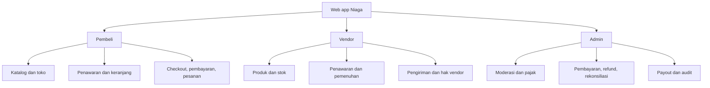
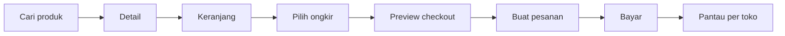
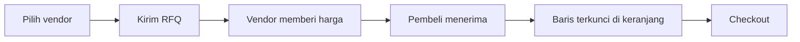
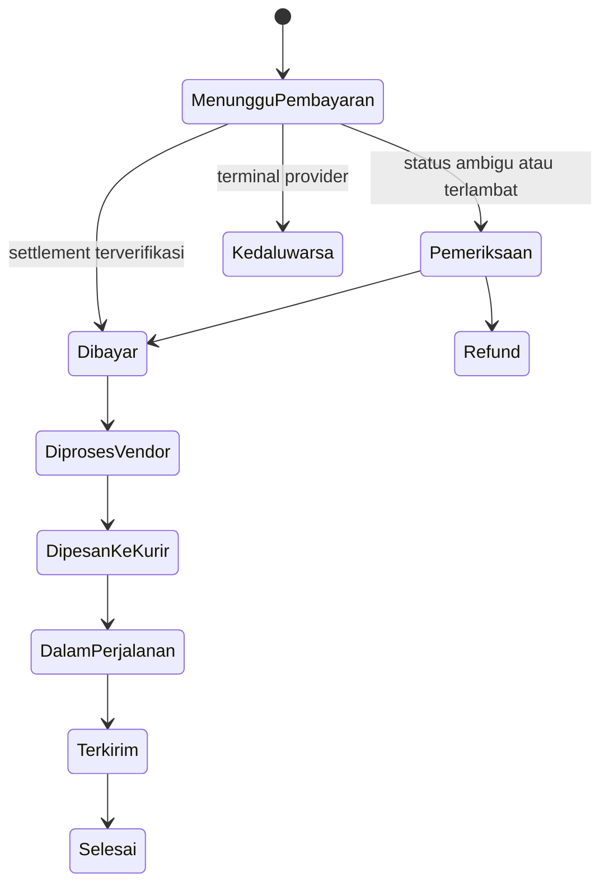
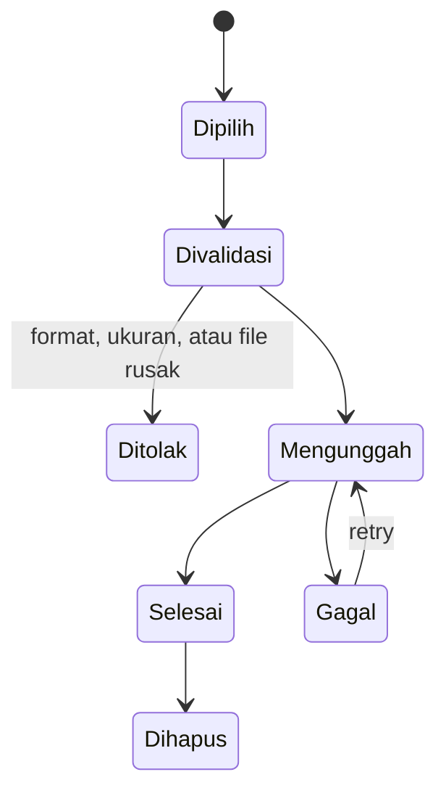

# Wireframe UI/UX Marketplace Multi-vendor

**Web app responsif untuk pembeli, vendor, dan admin**  
Versi 0.1 • 6 September 2026  
Acuan: SRS v0.2, ERD v0.1, dan OpenAPI v0.1  
Prototipe: [Niaga — Wireframe Marketplace](https://marketplace-blue-wireframe.b46usf.chatgpt.site)

Dokumen ini mendefinisikan struktur layar, navigasi, komponen, interaksi, validasi, dan state antarmuka. Nama kerja produk adalah **Niaga**. Tema biru mengambil nuansa layanan digital Indonesia seperti BCA dan Blibli tanpa memakai logo, aset, atau identitas resmi keduanya.

## 1. Tujuan dan prinsip

| Prinsip | Implementasi UI/UX |
| --- | --- |
| Tugas utama terlihat cepat | Katalog membuka pencarian dan produk; dashboard membuka pekerjaan yang perlu ditindaklanjuti |
| Satu status, satu arti | Pembayaran, pemenuhan, refund, dan payout ditampilkan terpisah |
| Total selalu transparan | Barang, PPN, ongkir, diskon, biaya pembeli, dan total ditampilkan sebelum pembayaran |
| Aman terhadap klik ulang | Tombol transaksi masuk state proses dan tidak menciptakan operasi kedua |
| Multi-vendor mudah dipahami | Keranjang, checkout, pesanan, pengiriman, dan refund dikelompokkan per toko |
| Mobile tetap lengkap | Semua tugas utama dapat dilakukan pada browser mobile tanpa aplikasi native |
| Integrasi dapat gagal | Timeout, review, retry, dan rekonsiliasi memiliki state yang jelas |
| Data sensitif dibatasi | NPWP/NIK, rekening, dokumen, dan alamat hanya tampil sesuai hak akses |

## 2. Design system

### 2.1 Warna

| Token | Nilai | Penggunaan |
| --- | --- | --- |
| Navy | `#083A79` | Header, judul kuat, identitas merek |
| Primary Blue | `#0878DC` | Tombol utama, link, tab aktif, fokus |
| Accent Blue | `#0099ED` | Indikator aktif dan aksen ringan |
| Light Blue | `#EEF7FF` | Informasi, pilihan aktif, latar pendukung |
| Background | `#F5F8FC` | Latar halaman |
| Surface | `#FFFFFF` | Card, dialog, tabel, form |
| Border | `#DCE5EF` | Garis bidang dan input |
| Ink | `#152E4A` | Teks utama |
| Muted | `#718196` | Teks sekunder |
| Success | `#15765D` | Berhasil, aktif, selesai |
| Warning | `#A46E18` | Menunggu, perlu tindakan |
| Danger | `#BA3944` | Gagal, tolak, suspend, destructive |

Warna tidak menjadi satu-satunya pembeda status. Badge selalu menyertakan teks dan, bila perlu, ikon.

### 2.2 Tipografi dan jarak

| Elemen | Ukuran minimum | Catatan |
| --- | --- | --- |
| Judul halaman | 24–32 px | Maksimal dua baris pada mobile |
| Heading card | 18–20 px | Kontras dengan label |
| Body | 16 px | Line height 1.5 atau lebih |
| Label form/tabel | 14 px | Metadata sekunder boleh 12–13 px |
| Tombol | 14–16 px | Tinggi sentuh minimum 44 px |
| Grid spacing | 8 px dasar | 8, 12, 16, 24, 32, 48 |
| Radius | 8–12 px | Card 12 px; input 8 px |

### 2.3 Breakpoint

| Lebar | Pola |
| --- | --- |
| 360–679 px | Satu kolom, navigasi horizontal ringkas, tabel menjadi scroll/card |
| 680–899 px | Satu atau dua kolom, sidebar dapat dilipat |
| 900–1199 px | Sidebar 200 px, form utama + panel ringkas |
| ≥1200 px | Sidebar 236 px, konten maksimal 1600 px |

### 2.4 Ukuran placeholder gambar

| Konteks | Rasio dan ukuran rekomendasi | Label placeholder |
| --- | --- | --- |
| Foto produk | 1:1 · 800 × 800 px | “800 × 800 px — Foto produk” |
| Thumbnail produk | 1:1 · 160 × 160 px | “160 × 160 px — Thumbnail” |
| Banner beranda | 2.5:1 · 1200 × 480 px | “1200 × 480 px — Banner promosi” |
| Banner toko | 3:1 · 1200 × 400 px | “1200 × 400 px — Banner toko” |
| Logo toko | 1:1 · 400 × 400 px | “400 × 400 px — Logo toko” |
| Avatar pengguna | 1:1 · 256 × 256 px | “256 × 256 px — Foto profil” |
| Bukti transaksi | Dokumen asli | Ikon dokumen, nama, ukuran file |

Placeholder menggunakan bidang abu-biru, ikon gambar, ukuran, rasio, dan nama konteks. Placeholder tidak dihitung sebagai gambar yang telah diunggah.

## 3. Kerangka aplikasi

### 3.1 Header global

| Area | Isi dan perilaku |
| --- | --- |
| Logo | Kembali ke halaman utama sesuai peran |
| Search | Produk, kategori, toko; autosuggest sesudah 2 karakter |
| Keranjang | Badge jumlah jenis barang, bukan total kuantitas |
| Notifikasi | Daftar belum dibaca; link tetap memeriksa izin |
| Akun | Profil, konteks pembeli, toko aktif, logout |
| Role switcher | Pembeli, Vendor, Admin hanya jika pengguna mempunyai akses |
| Locale | Indonesia dan IDR pada MVP |

### 3.2 Sidebar per peran

| Pembeli | Vendor | Admin |
| --- | --- | --- |
| Jelajahi produk | Ringkasan toko | Ringkasan platform |
| Keranjang | Produk | Moderasi vendor |
| Penawaran | Persediaan | Kategori dan kelas pajak |
| Pesanan | Permintaan harga | Transaksi dan rekonsiliasi |
| Refund dan komplain | Pesanan masuk | Refund dan kasus |
| Alamat dan organisasi | Pengiriman | Payout |
| Profil | Hak penerimaan | Audit |
|  | Profil, asal, rekening | Pengaturan kebijakan |

### 3.3 Pola state universal

| State | Tampilan |
| --- | --- |
| Loading awal | Skeleton mengikuti bentuk konten |
| Proses mutation | Tombol disabled + spinner + label “Memproses…” |
| Empty | Judul, alasan singkat, satu tindakan utama |
| Error field | Pesan tepat di bawah field dan fokus ke error pertama |
| Error halaman | Pesan, request ID, retry; data lama dipertahankan bila aman |
| Offline | Banner tetap; mutation diblokir sampai koneksi kembali |
| Provider timeout | Status “Dalam pemeriksaan”, link refresh, tanpa klaim berhasil/gagal |
| Forbidden | Halaman 403 tanpa mengungkap keberadaan resource lain |
| Not found | Halaman 404 dengan kembali ke daftar |
| Stale version | Dialog data berubah, muat ulang, perubahan lokal dijelaskan |

## 4. Arsitektur informasi

## 5. Alur utama

### 5.1 Pembelian langsung

### 5.2 Permintaan penawaran

### 5.3 Pembayaran dan pengiriman

## 6. Inventaris layar

| ID | Layar | Peran | Prioritas |
| --- | --- | --- | --- |
| PUB-01 | Registrasi | Publik | P0 |
| PUB-02 | Login dan reset password | Publik | P0 |
| PUB-03 | Syarat, privasi, dan kebijakan | Publik | P0 |
| PUB-04 | Status layanan | Publik | P1 |
| BUY-01 | Beranda dan katalog | Pembeli | P0 |
| BUY-02 | Hasil pencarian dan filter | Pembeli | P0 |
| BUY-03 | Detail produk | Pembeli | P0 |
| BUY-04 | Profil toko | Pembeli | P0 |
| BUY-05 | Keranjang multi-vendor | Pembeli | P0 |
| BUY-06 | Checkout | Pembeli | P0 |
| BUY-07 | Sesi pembayaran | Pembeli | P0 |
| BUY-08 | Daftar pesanan | Pembeli | P0 |
| BUY-09 | Detail pesanan | Pembeli | P0 |
| BUY-10 | Tracking pengiriman | Pembeli | P0 |
| BUY-11 | Daftar dan detail RFQ | Pembeli | P0 |
| BUY-12 | Buat RFQ | Pembeli | P0 |
| BUY-13 | Komplain dan refund | Pembeli | P0 |
| BUY-14 | Alamat | Pembeli | P0 |
| BUY-15 | Organisasi | Pembeli | P0 |
| VEN-01 | Onboarding entitas dan toko | Vendor | P0 |
| VEN-02 | Dashboard toko | Vendor | P0 |
| VEN-03 | Daftar produk | Vendor | P0 |
| VEN-04 | Tambah/edit produk | Vendor | P0 |
| VEN-05 | Persediaan | Vendor | P0 |
| VEN-06 | Daftar/detail RFQ | Vendor | P0 |
| VEN-07 | Buat versi penawaran | Vendor | P0 |
| VEN-08 | Daftar/detail pesanan | Vendor | P0 |
| VEN-09 | Siap kirim dan tracking | Vendor | P0 |
| VEN-10 | Hak penerimaan dan payout | Vendor | P0 |
| VEN-11 | Profil toko dan alamat asal | Vendor | P0 |
| VEN-12 | Rekening vendor | Vendor | P0 |
| ADM-01 | Dashboard platform | Admin | P0 |
| ADM-02 | Moderasi entitas dan toko | Operasional | P0 |
| ADM-03 | Kategori dan kelas pajak | Operasional/Finance | P0 |
| ADM-04 | Profil dan kebijakan pajak | Finance | P0 |
| ADM-05 | Kebijakan komisi | Finance | P0 |
| ADM-06 | Payment review | Finance | P0 |
| ADM-07 | Rekonsiliasi | Finance | P0 |
| ADM-08 | Refund | Finance | P0 |
| ADM-09 | Kasus/komplain | Operasional/Finance | P0 |
| ADM-10 | Pengiriman review | Operasional | P0 |
| ADM-11 | Payout maker/checker | Finance | P0 |
| ADM-12 | Jurnal dan audit | Finance/Superadmin | P0 |
| SYS-01 | Notifikasi | Semua login | P0 |
| SYS-02 | Operasi asinkron | Semua sesuai resource | P0 |
| SYS-03 | Error, empty, dan maintenance | Semua | P0 |

## 7. Wireframe publik

### PUB-01 — Registrasi

| Urutan | Komponen | Detail |
| --- | --- | --- |
| 1 | Logo dan judul | “Buat akun Niaga” |
| 2 | Nama lengkap | Wajib, maksimal 150 karakter |
| 3 | Email | Format email; verifikasi setelah submit |
| 4 | Password | Minimal 12 karakter; toggle tampilkan |
| 5 | Persetujuan | Syarat layanan dan kebijakan privasi |
| 6 | Tombol | “Buat akun”; state loading |
| 7 | Alternatif | Link login |

**State:** email sudah digunakan, password lemah, submit berhasil dengan instruksi verifikasi, token verifikasi kedaluwarsa.

### PUB-02 — Login dan pemulihan

Login menampilkan email, password, “Lupa password”, dan tombol login. Respons lupa password selalu generik. Reset password menampilkan password baru, konfirmasi, aturan password, dan status token. Setelah login berhasil, aplikasi kembali ke tujuan awal yang masih diizinkan.

### PUB-03 — Syarat, privasi, dan kebijakan

| Area | Isi dan perilaku |
| --- | --- |
| Daftar isi | Syarat layanan, kebijakan privasi, kebijakan transaksi, refund, dan penggunaan data |
| Isi dokumen | Judul, nomor versi, tanggal berlaku, paragraf bernomor, dan tautan silang |
| Riwayat versi | Versi aktif serta ringkasan perubahan versi sebelumnya |
| Persetujuan | Checkbox hanya muncul pada alur yang membutuhkan consent eksplisit |
| Aksi | Unduh/cetak, kembali ke alur sebelumnya, dan hubungi bantuan |

Pada mobile, daftar isi menjadi dropdown. Tautan persetujuan membuka dokumen di tab baru agar data form pengguna tidak hilang. Versi kebijakan yang disetujui disimpan bersama waktu dan identitas pengguna.

### PUB-04 — Status layanan

| Area | Isi dan perilaku |
| --- | --- |
| Status utama | “Semua layanan normal” atau ringkasan insiden aktif dengan warna dan ikon |
| Komponen layanan | Web app, autentikasi, pembayaran, pengiriman, notifikasi, dan integrasi mitra |
| Riwayat | Insiden 30 hari terakhir, waktu mulai, pembaruan, dan waktu selesai |
| Detail insiden | Dampak, layanan terdampak, status investigasi, dan pembaruan kronologis |
| Aksi | Muat ulang, kembali ke beranda, dan buka pusat bantuan |

Status provider eksternal ditulis sebagai kondisi integrasi Niaga, bukan klaim atas seluruh sistem provider. Halaman tetap ringan dan dapat dimuat ketika layanan utama mengalami gangguan.

## 8. Wireframe pembeli

### BUY-01 — Beranda dan katalog

| Area | Isi |
| --- | --- |
| Search utama | Placeholder “Cari produk, kebutuhan sekolah, dan lainnya” |
| Banner | Placeholder 1200 × 480 px, judul, CTA kategori |
| Chip kategori | Semua, ATK, Elektronik, Furnitur, Pendidikan |
| Kartu produk | Placeholder 800 × 800 px, badge, nama, harga, toko, rating, lokasi |
| Rekomendasi | Berdasarkan kategori populer; tanpa personalisasi sensitif |
| Pagination | Cursor dengan “Muat lainnya” atau pagination |

**Empty:** pencarian tidak ditemukan dengan tombol reset.  
**Error:** katalog gagal dimuat; search/filter tetap dapat diubah.

### BUY-02 — Hasil pencarian dan filter

Desktop memakai filter kiri; mobile memakai bottom sheet.

| Filter | Kontrol |
| --- | --- |
| Kategori | Hierarki checkbox |
| Harga | Minimum dan maksimum rupiah |
| Lokasi vendor | Combobox area |
| Ketersediaan | Siap kirim |
| Opsi | Penawaran tersedia |
| Sort | Relevansi, harga naik/turun, terbaru |

Filter aktif muncul sebagai chip yang dapat dihapus. URL menyimpan query agar halaman dapat dibagikan.

### BUY-03 — Detail produk

| Kolom gambar | Kolom informasi |
| --- | --- |
| Foto utama 800 × 800 px | Nama, rating, terjual |
| Thumbnail 160 × 160 px | Harga termasuk pajak bila berlaku |
| Zoom/dialog foto | Vendor, lokasi, status |
| Placeholder ukuran bila kosong | Pilih varian, kuantitas |
|  | Tambah ke keranjang, ajukan penawaran |
|  | Deskripsi rich text yang sudah disanitasi |
|  | Spesifikasi dan pengiriman |

Varian tidak tersedia disabled. Perubahan varian mengganti harga, stok, foto, berat, dan URL. Deskripsi hasil editor tidak boleh menjalankan script atau style berbahaya.

### BUY-04 — Profil toko

Header memakai logo 400 × 400 px dan banner 1200 × 400 px. Tampilkan nama, status terverifikasi, kota, rating, metrik layanan, kategori, search khusus toko, dan grid produk. Kontak pribadi vendor tidak ditampilkan di luar aturan platform.

### BUY-05 — Keranjang multi-vendor

Setiap card toko berisi checkbox toko, item, sumber harga, varian, harga unit, kuantitas, subtotal, dan masalah validasi.

| Kondisi | Respons UI |
| --- | --- |
| Harga katalog berubah | Sorot harga lama/baru; perlu konfirmasi |
| Quote item | Badge “Harga penawaran”; kuantitas terkunci |
| Quote tidak lengkap | Semua baris versi ditandai dan checkout diblokir |
| Stok kurang | Kuantitas maksimum dan tombol sesuaikan |
| Produk/toko nonaktif | Item disabled; tombol hapus |
| Multi-vendor | Ringkasan memisahkan estimasi ongkir per toko |

CTA “Lanjut checkout” hanya aktif jika seluruh item terpilih valid.

### BUY-06 — Checkout

Urutan layar:

1. Pilih konteks individu/organisasi.
2. Pilih alamat tujuan.
3. Tampilkan satu kelompok pengiriman per vendor.
4. Muat pilihan kurir dari Biteship.
5. Tampilkan produk, PPN per toko, ongkir, diskon, biaya pembeli, total.
6. Tampilkan metode pembayaran yang memenuhi nominal dan akun provider.
7. Pengguna menyetujui ringkasan lalu memilih “Buat pesanan & bayar”.

| State ongkir | Tampilan |
| --- | --- |
| Loading | Skeleton opsi per toko |
| Tersedia | Kurir, layanan, estimasi, harga |
| Timeout | “Ongkir belum tersedia”, retry |
| Layanan hilang | Pilihan dibatalkan dan total diperbarui |
| Harga berubah | Dialog perbandingan dan konfirmasi ulang |

Biaya payment gateway/MDR tidak muncul sebagai surcharge pembeli. Total server menjadi sumber utama.

### BUY-07 — Pembayaran

| Area | Isi |
| --- | --- |
| Header | Nomor grup order dan sisa waktu dari provider |
| Metode | VA, QRIS, e-wallet yang aktif |
| Instruksi | Nomor VA atau QR provider; tombol buka aplikasi bila tersedia |
| Status | Menunggu, dibayar, gagal, kedaluwarsa, review |
| Aksi | Salin nomor, cek status, ganti metode setelah attempt lama terminal |

Redirect browser berhasil menampilkan “Memeriksa pembayaran”, kemudian mengambil status backend. UI baru menampilkan “Dibayar” setelah settlement terverifikasi. Status ambigu memakai label “Dalam pemeriksaan” dan tidak menawarkan attempt kedua.

### BUY-08 — Daftar pesanan

Filter: semua, menunggu pembayaran, diproses, dikirim, selesai, dibatalkan, review. Satu card mewakili CheckoutGroup dan menampilkan vendor-order di dalamnya. Total grup, status pembayaran, serta status pengiriman setiap toko ditampilkan terpisah.

### BUY-09 — Detail pesanan

| Bagian | Isi |
| --- | --- |
| Ringkasan grup | Nomor, dibuat, total, payment status |
| Vendor-order | Toko, item snapshot, harga, pajak, ongkir |
| Status | Timeline fulfillment per toko |
| Alamat | Snapshot penerima |
| Pembayaran | Metode, waktu diterima, refund |
| Aksi | Bayar, cancel request, tracking, konfirmasi terima, komplain |

Cancel menampilkan dialog konsekuensi dan status “Pembatalan diperiksa”. Tombol tidak langsung menghapus order atau melepas stok.

### BUY-10 — Tracking

Tampilkan vendor, kurir, layanan, resi dengan tombol salin, status internal, dan timeline event. State perubahan resi menyimpan resi sebelumnya sebagai histori. Perubahan biaya aktual tidak ditagihkan otomatis ke pembeli.

### BUY-11 — Daftar dan detail penawaran

Tab: menunggu vendor, ditawarkan, diterima, ditolak, kedaluwarsa, digunakan. Detail menunjukkan kebutuhan awal dan versi penawaran dalam timeline. Versi terbaru memiliki harga, jumlah, masa berlaku, dan aksi terima/tolak.

### BUY-12 — Buat RFQ

| Field | Aturan |
| --- | --- |
| Vendor | Satu vendor per RFQ |
| Produk/SKU | Hanya produk vendor yang sama |
| Jumlah | Integer positif |
| Tujuan | Pilih alamat untuk konteks ongkir |
| Catatan | Maksimal 2.000 karakter |

Pembeli dapat menambah beberapa baris. Submit menghasilkan satu RFQ. Harga belum mereservasi stok.

### BUY-13 — Komplain dan refund

Form komplain berisi vendor-order, jenis masalah, item, kuantitas, alasan, dan lampiran placeholder dokumen. Detail kasus menampilkan status, percakapan terstruktur/riwayat keputusan, nominal refund yang diminta dan berhasil. “Refund diproses” tidak disamakan dengan uang telah kembali.

### BUY-14 — Alamat

Card alamat menampilkan label, penerima, nomor tersamarkan sebagian, alamat, badge utama, dan aksi edit/arsip. Editor alamat menggunakan provinsi/kota/kecamatan/kode pos serta area ID/koordinat melalui backend. Arsip tidak mengubah snapshot pesanan lama.

### BUY-15 — Organisasi

Daftar konteks pembelian menampilkan personal dan organisasi. Form organisasi memuat jenis, nama, kontak, dan ID sekolah opsional. MVP memakai satu pengelola. Perubahan pengelola membutuhkan proses dukungan/admin dan audit.

## 9. Wireframe vendor

### VEN-01 — Onboarding entitas dan toko

Stepper:

1. Identitas legal: individu/perusahaan, nama legal, NIK/NPWP.
2. Dokumen: multiple drag-and-drop, tipe, masa berlaku.
3. Profil toko: nama, slug, kontak.
4. Alamat asal: kontak, alamat, kode pos, area Biteship.
5. Rekening: bank, nama, nomor.
6. Ringkasan dan submit.

Nomor identitas/rekening ditampilkan tersamarkan setelah disimpan. Status: draft, diajukan, perlu perbaikan, aktif, ditolak, ditangguhkan.

### VEN-02 — Dashboard toko

| Widget | Isi |
| --- | --- |
| Penjualan dibayar | Periode dan perbandingan |
| Pesanan baru | Jumlah serta yang perlu diproses |
| Produk aktif | Stok menipis |
| RFQ | Belum dibalas dan mendekati tenggat |
| Tugas | Lengkapi produk, siap kirim, kasus |
| Payout | Saldo eligible, reserved, paid |

Angka dana dibedakan antara nilai order, pembayaran diterima, dan hak vendor.

### VEN-03 — Daftar produk

Tabel desktop/card mobile: thumbnail 160 × 160 px, nama/SKU, kategori, harga, stok tersedia, status, diubah, dan menu aksi. Filter draft/aktif/arsip, search SKU/nama, dan sort. Bulk publish hanya tersedia jika setiap baris lolos validasi.

### VEN-04 — Tambah/edit produk

#### Multiple image upload

| Ketentuan | Perilaku |
| --- | --- |
| Jumlah | 1–8 foto |
| Format | JPG, PNG, WebP |
| Ukuran | Maksimal 5 MB per foto |
| Rekomendasi | 800 × 800 px, rasio 1:1 |
| Input | Klik file picker dengan `multiple` atau drag-and-drop |
| Urutan | Drag antar thumbnail dan tombol panah |
| Foto utama | Item pertama; badge “Utama” |
| Hapus | Tombol per gambar; konfirmasi jika sudah tersimpan |
| Progress | Progress per file, sukses, retry, gagal |

Dropzone memiliki label keyboard dan dapat dibuka dengan Enter/Space. URL blob lokal hanya untuk preview; produksi menggunakan upload terautentikasi. Daftar menampilkan nama file, ukuran, dimensi aktual, progress, dan pesan error.

#### Editor deskripsi

Toolbar:

- Paragraf, Heading 2, Heading 3.
- Bold, italic, underline.
- Bullet dan numbered list.
- Link dengan validasi protokol.
- Undo, redo, hapus format.

Editor menampilkan penghitung karakter dan preview hasil sanitasi. Paste dari Word dibersihkan. Script, iframe, inline event, style, dan HTML tidak aman dihapus. Deskripsi disimpan dalam format terstruktur atau HTML tersanitasi sesuai keputusan teknis.

#### Field produk

| Kelompok | Field |
| --- | --- |
| Informasi | Nama, kategori, kelas pajak, atribut |
| Varian | SKU, atribut varian, satuan |
| Harga | Harga gross termasuk pajak bila berlaku |
| Persediaan | On hand dan available |
| Paket | Berat gram, panjang, lebar, tinggi cm |
| Status | Draft, terbitkan, arsip |

Panel kanan menampilkan pratinjau kartu secara langsung dan checklist kelengkapan. Publish memeriksa toko aktif, kelas pajak, foto asli, SKU, harga, serta kemasan.

### VEN-05 — Persediaan

Daftar SKU menampilkan on hand, reserved, available, dan peringatan stok. Adjustment menggunakan jumlah signed, alasan, dan If-Match/versi. UI menolak hasil on hand di bawah reserved. Riwayat movement menampilkan restock, reserve, consume, release, adjust, dan return.

### VEN-06 — Daftar/detail RFQ

Daftar memprioritaskan RFQ mendekati tenggat. Detail memuat pembeli/organisasi secukupnya, tujuan ringkas, produk, jumlah, dan histori versi. Data kontak yang tidak dibutuhkan tidak ditampilkan.

### VEN-07 — Buat versi penawaran

Vendor mengisi harga per baris dan masa berlaku. Sistem menghitung total. Tombol “Kirim penawaran” membuat versi baru setelah konfirmasi. Jika versi telah accepted, revisi dinonaktifkan. Status stale menampilkan data pembeli telah berubah dan meminta reload.

### VEN-08 — Daftar/detail pesanan

Filter berdasarkan fulfillment, payment, kasus, dan tanggal. Detail vendor hanya memuat bagiannya: item, alamat penerima yang diperlukan, ongkir, komisi, PPN komisi, PPh bila berlaku, hak vendor, dan timeline.

### VEN-09 — Siap kirim dan tracking

CTA “Paket siap dikirim” aktif setelah pembayaran dan stok terverifikasi. Dialog menampilkan kemasan, asal, tujuan, kurir, dan estimasi. Sesudah submit:

| State | Tampilan |
| --- | --- |
| Booking | Spinner dan operation ID |
| Booked | Resi, label bila tersedia, jadwal pickup |
| Unknown | “Booking diperiksa”; tombol tidak dapat diklik ulang |
| Review | Link hubungi operasional |
| Tracking | Timeline event kurir |

### VEN-10 — Hak penerimaan dan payout

Tampilkan accrued, adjustment, reserved payout, paid, balance, eligibility, dan alasan block. Vendor dapat melihat payout dan bukti tersamarkan. Vendor tidak membuat transfer atau menyetujui payout.

### VEN-11 — Profil toko dan asal

Form profil memuat logo 400 × 400 px, banner 1200 × 400 px, nama, deskripsi, kontak, lokasi, dan jam operasional. Perubahan alamat asal menginvalidasi quote ongkir yang belum dipakai.

### VEN-12 — Rekening

Form rekening menampilkan bank, nama pemilik, nomor, status verifikasi, dan waktu. Penggantian nomor membuat data baru dan verifikasi ulang. Nomor selalu masked setelah submit.

## 10. Wireframe admin

### ADM-01 — Dashboard platform

Dashboard menggunakan widget operasional:

- Nilai pembayaran berhasil dan jumlah receipt.
- Vendor aktif dan antrean verifikasi.
- Pesanan dalam review.
- Refund dan payout tertunda.
- Booking pengiriman bermasalah.
- Rekonsiliasi terbuka.

Nilai keuangan dilengkapi definisi dan periode agar tidak tertukar dengan omzet atau pendapatan platform.

### ADM-02 — Moderasi entitas dan toko

Split view: antrean kiri dan detail kanan. Detail memuat identitas masked, dokumen dengan viewer privat, profil toko, asal, rekening, catatan, dan histori keputusan. Aksi approve/reject/suspend meminta alasan. Keputusan sensitif tidak dilakukan dari tabel tanpa review.

### ADM-03 — Kategori dan kelas pajak

Kategori memakai tree dengan pencarian, urut, archive, dan schema atribut. Editor kelas pajak menampilkan kode, nama, status unverified/active/disabled, dan penggunaan produk. Aktivasi membutuhkan finance.

### ADM-04 — Profil dan kebijakan pajak

| Panel | Isi |
| --- | --- |
| Legal entity | Nama, jenis, status verifikasi |
| Tax profile | PKP, collector enabled, periode |
| Dokumen | PKP, SKB, pernyataan omzet, dasar penunjukan |
| Policy | Jenis, rate, DPP numerator/denominator |
| Preview | Contoh perhitungan dengan data fixture |
| Histori | Versi, tanggal efektif, aktor |

`collector_enabled` hanya dapat aktif untuk entitas platform dengan dasar yang valid. UI memperingatkan jika rentang kebijakan overlap.

### ADM-05 — Kebijakan komisi

Daftar kebijakan menampilkan scope kategori/default, komisi, biaya pembeli, periode, dan status. Editor memiliki simulasi margin berdasarkan nilai order dan channel pembayaran. Nilai 2% tetap diberi label usulan bisnis.

### ADM-06 — Payment review

Tabel: provider order ID, CheckoutGroup, expected, actual, channel, status lokal/provider, waktu, dan alasan review. Detail menampilkan event timeline, signature verification, hasil status API, receipt, allocations, dan journal. Tidak tersedia tombol “Set paid” manual tanpa bukti receipt terverifikasi.

### ADM-07 — Rekonsiliasi

Form run memilih provider, periode, dan dokumen laporan. Hasil dikelompokkan: missing local, missing provider, amount, fee, status. Setiap item memiliki owner, bukti, resolusi, dan jurnal adjustment bila perlu.

### ADM-08 — Refund

Flow:

1. Pilih payment receipt.
2. Pilih vendor-order/item dan komponen.
3. Masukkan nominal/alasan.
4. Sistem menunjukkan refundable balance.
5. Maker mengajukan.
6. Finance menyetujui dan mengantre proses.
7. Webhook/status API menentukan succeeded/failed/unknown.

Unknown tetap menahan kapasitas refund. Refund manual mensyaratkan bukti dan referensi eksternal.

### ADM-09 — Kasus/komplain

Kanban/list: open, investigasi, menunggu pihak, resolved, rejected. Detail menampilkan order snapshot, pengiriman, pembayaran, refund terkait, bukti, dan riwayat. Kasus terbuka memblokir payout vendor-order.

### ADM-10 — Pengiriman review

Antrean menampilkan booking timeout, event tidak terverifikasi, perubahan harga, gagal kirim, dan resi berubah. Aksi rekonsiliasi mengambil status provider. Payload tak terverifikasi tidak dapat mengubah order menjadi delivered.

### ADM-11 — Payout maker/checker

Maker memilih satu toko, rekening verified, dan payable eligible. Sistem mengunci allocation saat draft/processing. Checker berbeda memeriksa:

- Dana provider tersedia.
- Pesanan selesai dan masa komplain lewat.
- Tidak ada kasus/refund terbuka.
- Rekening dan jumlah cocok.
- Bukti transfer belum pernah digunakan.

State: draft, approved, processing, unknown, paid, failed, rejected. Unknown tetap menahan saldo.

### ADM-12 — Jurnal dan audit

Jurnal hanya read-only dari UI. Detail menampilkan event key, debit, kredit, account, vendor-order, receipt/refund/payout, dan reversal. Posting tidak seimbang tampil sebagai kegagalan sistem. Audit log menampilkan aktor, waktu, objek, aksi, alasan, dan before/after yang sudah disensor.

## 11. Komponen sistem

### SYS-01 — Notifikasi

Drawer notifikasi memiliki filter order, payment, shipment, refund. Setiap item menampilkan waktu, status baca, dan tautan. Mark as read tidak mengubah status bisnis.

### SYS-02 — Operation status

Untuk pembayaran, booking, refund, rekonsiliasi, dan cancel:

| State | Copy |
| --- | --- |
| QUEUED | “Permintaan diterima” |
| PROCESSING | “Sedang diproses” |
| SUCCEEDED | “Proses selesai” |
| FAILED | “Proses gagal” + alasan aman |
| REVIEW | “Perlu pemeriksaan” |

Polling mengikuti `Retry-After`. Pengguna dapat meninggalkan halaman; notifikasi memperbarui hasil.

### SYS-03 — Error dan maintenance

| Kode UI | Pesan dan aksi |
| --- | --- |
| 401 | Session berakhir; login lalu kembali |
| 403 | Tidak memiliki akses |
| 404 | Data tidak ditemukan |
| 409 | Data berubah atau konflik; tampilkan pilihan reload |
| 412 | Versi lama; reload sambil jelaskan perubahan lokal |
| 422 | Sorot field atau aturan bisnis |
| 429 | Tunggu dan retry sesuai waktu |
| 503 | Layanan sementara tidak tersedia; data lokal tetap aman |

## 12. Dialog konfirmasi

| Aksi | Isi wajib |
| --- | --- |
| Terbitkan produk | Ringkasan kelengkapan dan dampak katalog |
| Terima quote | Harga, jumlah, tenggat, item terkunci |
| Buat order | Total final dan vendor |
| Cancel order | Status pemeriksaan provider dan stok |
| Tandai siap kirim | Paket, kurir, asal/tujuan |
| Approve refund | Receipt, allocation, nominal, alasan |
| Approve payout | Rekening masked, payable, checker |
| Suspend toko | Dampak pada katalog dan alasan |
| Aktifkan pajak/fee | Scope, rate, DPP, tanggal efektif |

Destructive action memakai tombol merah dan fokus awal pada tombol batal.

## 13. Validasi form

| Input | Validasi |
| --- | --- |
| Nama produk | 1–100 karakter |
| SKU | Unik dalam toko |
| Harga | Integer rupiah >0 |
| Stok | Integer ≥0 dan on hand tidak di bawah reserved |
| Berat | Integer gram >0 |
| Dimensi | Angka cm >0 |
| Foto | 1–8; JPG/PNG/WebP; ≤5 MB |
| Deskripsi | Wajib; hasil sanitasi tidak kosong |
| Quote quantity | Integer positif |
| Tenggat | Masa depan dan sesuai kebijakan |
| Refund | >0 dan tidak melampaui refundable balance |
| Payout | >0 dan tidak melampaui saldo bebas |
| Alamat | Penerima, telepon, jalan, wilayah, kode pos |
| Dokumen | Tipe/ukuran sesuai kebijakan, scan berhasil |

Validasi client mempercepat feedback. Backend tetap menjadi sumber keputusan.

## 14. Aksesibilitas

- Semua input memiliki label terprogram.
- Dropzone dapat digunakan dengan keyboard.
- Editor memiliki toolbar berlabel dan state aktif.
- Dialog menahan fokus dan mengembalikannya ke pemicu.
- Error summary mengarahkan fokus ke field pertama.
- Kontras teks dan tombol mengikuti WCAG AA.
- Placeholder gambar mempunyai teks alternatif ukuran dan tujuan.
- Tabel mempunyai header; mobile menyediakan card semantik.
- Progress upload memiliki nilai dan status yang diumumkan.
- Animasi menghormati `prefers-reduced-motion`.
- Aplikasi tetap dapat digunakan pada zoom teks 200%.

## 15. Responsive behavior

| Komponen | Desktop | Mobile |
| --- | --- | --- |
| Sidebar | Tetap kiri | Bar horizontal atau drawer |
| Katalog | 4 kolom | 2 kolom; 1 kolom pada layar sangat kecil |
| Form produk | Form + preview kanan | Form lalu preview |
| Upload | 4–5 thumbnail/baris | 3 thumbnail/baris |
| Tabel | Kolom lengkap | Card atau horizontal scroll |
| Checkout | Konten + summary sticky | Summary setelah konten dan sticky CTA bawah |
| Filter | Sidebar | Bottom sheet |
| Dialog | Tengah, lebar terbatas | Hampir fullscreen |

## 16. Analytics event

| Event | Kapan |
| --- | --- |
| `search_submitted` | Search dikirim |
| `product_viewed` | Detail produk tampil |
| `add_to_cart` | Server menerima perubahan |
| `quote_requested` | RFQ berhasil dibuat |
| `quote_accepted` | Versi diterima |
| `shipping_rates_loaded` | Rates valid tampil |
| `checkout_previewed` | Preview valid dibuat |
| `order_created` | Confirm checkout sukses |
| `payment_session_opened` | Snap tersedia |
| `payment_settled` | Backend memverifikasi settlement |
| `shipment_booked` | Booking berhasil |
| `order_received` | Pembeli konfirmasi |
| `case_opened` | Komplain berhasil dibuat |

Jangan mengirim alamat, NPWP/NIK, nomor rekening, payload provider, atau deskripsi dokumen ke analytics.

## 17. Pemetaan layar ke API

| Layar | Operasi utama |
| --- | --- |
| Katalog/detail | `searchProducts`, `getProduct`, `getPublicStore` |
| Keranjang | `getCart`, `addCartItem`, `updateCartItem` |
| RFQ | `createQuoteRequest`, `offerQuote`, `acceptQuote` |
| Checkout | `getShippingRates`, `previewCheckout`, `confirmCheckout` |
| Pembayaran | `listPaymentMethods`, `createPaymentSession`, `getPaymentAttempt` |
| Pesanan | `getBuyerOrder`, `cancelOrderGroup` |
| Pengiriman | `readyToShip`, `getBuyerShipment` |
| Produk vendor | `createProduct`, `createSku`, `uploadProductMedia` |
| Stok | `getInventory`, `adjustStock` |
| Moderasi | `verifyLegalEntity`, `decideStore` |
| Pajak/fee | `createTaxProfile`, `createTaxPolicy`, `createFeePolicy` |
| Refund | `createRefund`, `approveRefund`, `getRefund` |
| Rekonsiliasi | `startReconciliation`, `getReconciliation` |
| Payout | `createPayout`, `approvePayout`, `recordPayoutResult` |

## 18. Acceptance criteria UI/UX

1. Pembeli dapat menemukan produk, menambah dua vendor, memilih ongkir per toko, dan memahami total sebelum order.
2. Quote yang diterima tampil berbeda dan kuantitasnya tidak dapat diubah.
3. Redirect pembayaran tidak pernah langsung menampilkan paid tanpa status backend.
4. Vendor dapat menambah 1–8 gambar, drag-and-drop, mengubah urutan, menghapus, dan melihat preview.
5. File salah format, rusak, melebihi ukuran, atau melebihi jumlah menampilkan error per file.
6. Editor deskripsi dapat membuat heading, emphasis, dan list; output berbahaya disanitasi.
7. Placeholder selalu menampilkan ukuran gambar yang disarankan.
8. Vendor dapat melihat on hand, reserved, dan available sebagai nilai berbeda.
9. Booking timeout menghasilkan review dan mencegah booking ganda.
10. Admin tidak dapat menandai pembayaran berhasil tanpa receipt provider terverifikasi.
11. Refund dan payout menampilkan state pending/unknown secara jujur.
12. Approver payout berbeda dari pembuat.
13. Seluruh tugas P0 dapat dijalankan pada viewport 360, 768, dan 1440 px.
14. Keyboard dapat mencapai navigasi, dropzone, editor, dialog, tabel, dan CTA.
15. Teks sensitif selalu masked sesuai peran.

## 19. Prioritas implementasi UI

| Sprint UI | Layar |
| --- | --- |
| 1 | Kerangka, auth, katalog, produk, keranjang |
| 2 | RFQ, rates, checkout, pesanan |
| 3 | Payment session/status, tracking |
| 4 | Onboarding vendor, produk, upload, editor, stok |
| 5 | Vendor order, ready-to-ship, payable |
| 6 | Moderasi, pajak, fee, payment review |
| 7 | Refund, kasus, rekonsiliasi, payout, audit |
| 8 | Responsive QA, aksesibilitas, state error, analytics |

## 20. Keputusan desain yang masih terbuka

| Keputusan | Baseline |
| --- | --- |
| Nama final | Niaga sebagai nama kerja |
| Font | Inter atau font sans-serif berlisensi yang dipilih brand |
| Search autosuggest | Produk, kategori, toko |
| Editor storage | Struktur JSON atau HTML tersanitasi |
| Upload transport | Direct signed upload atau backend multipart |
| Masa komplain | Belum ditetapkan |
| Konten legal | Memerlukan dokumen resmi |
| Format invoice | Invoice komersial dan referensi dokumen pajak |
| Empty illustration | Gunakan ikon sederhana; tidak memerlukan gambar generatif |

Dokumen ini menjadi spesifikasi UI/UX untuk wireframe dan desain high-fidelity berikutnya. Prototipe saat ini memakai data lokal simulasi; integrasi API, autentikasi, upload persisten, pembayaran, dan pengiriman perlu diterapkan pada tahap development.
